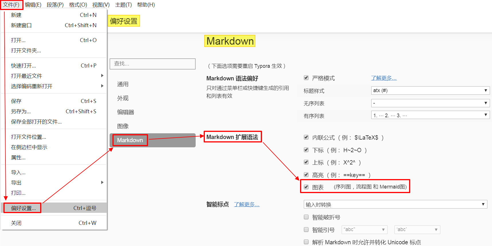
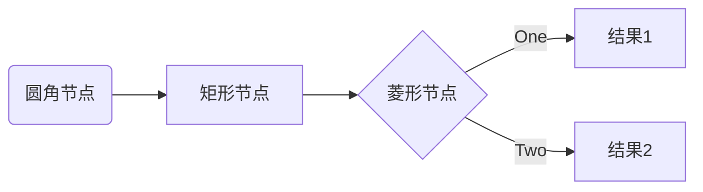
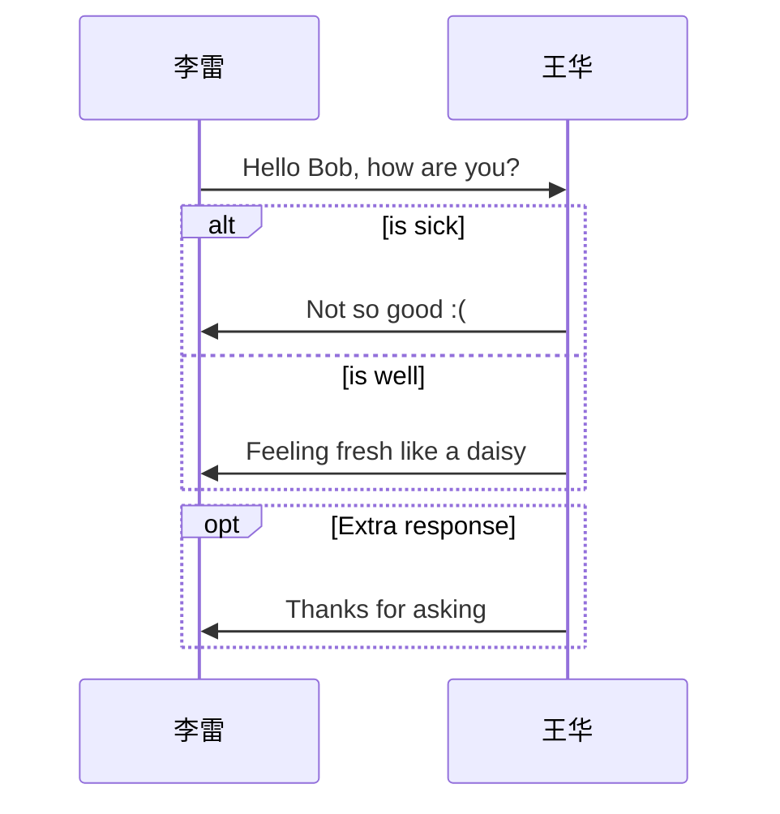
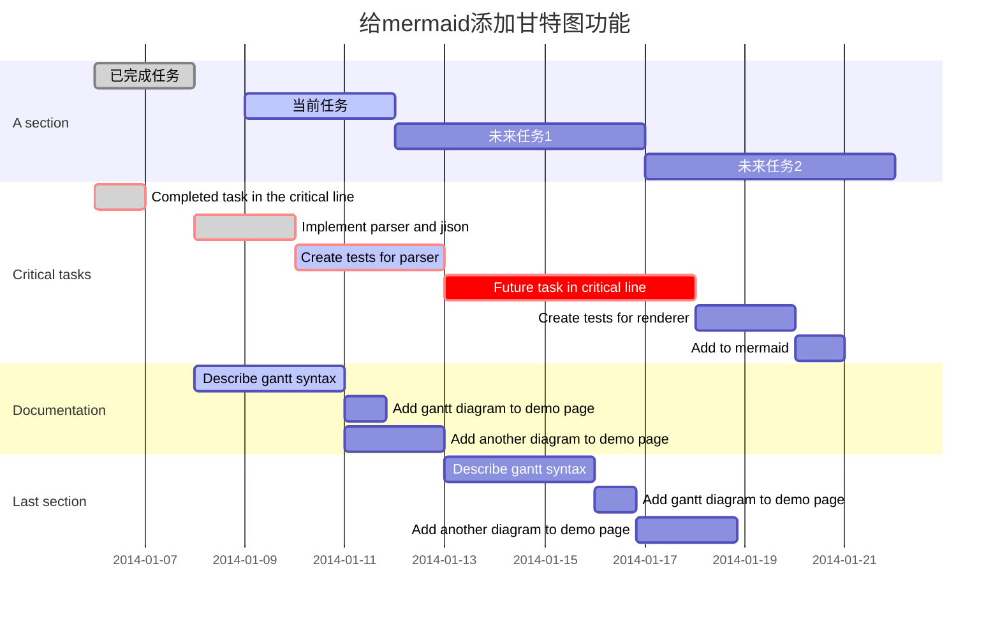
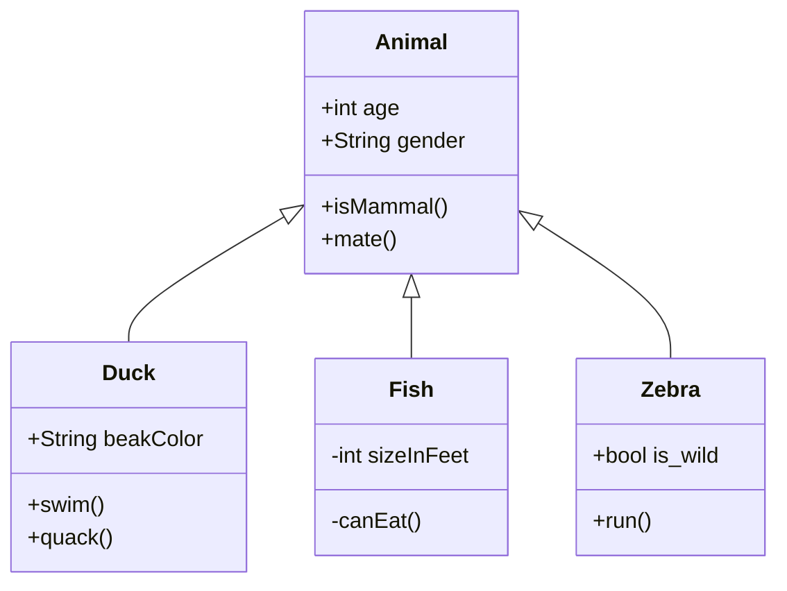
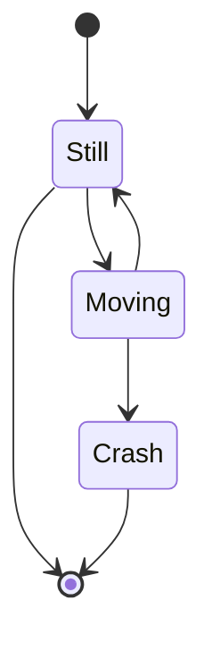
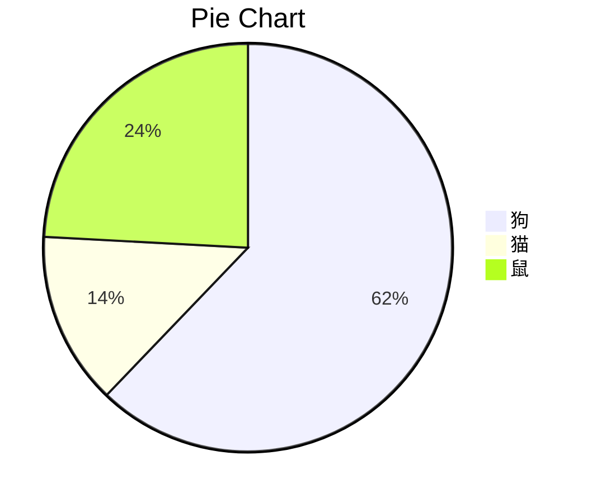

# <center>Typora学习笔记 - 绘图综述</center>


<center>文档历史记录</center>

----

| 版本 | 状态 |           作者           |    日期    | 说明                                                         |
| :--: | :--: | :----------------------: | :--------: | ------------------------------------------------------------ |
| V0.1 | 草稿 | [蒋苏](buaajs@gmail.com) | 2020-07-05 | 构建文档架构<br />参考[Typora官网文档](http://support.typora.io/Draw-Diagrams-With-Markdown/)完成草稿 |
| V0.2 | 初稿 | [蒋苏](buaajs@gmail.com) | 2020-07-08 | 调整文档架构<br />撰写第1.1 简介<br />修订第1.2-1.9章节      |

本文重点介绍在 Typora 上如何用`绘图代码块`完成绘制图（**Draw Diagrams with Code in Typora**）。

---

## 1.0 参考资料

|  类别   | 网址                                                  | 说明                 |
| :-----: | ----------------------------------------------------- | -------------------- |
| Website | http://support.typora.io/Draw-Diagrams-With-Markdown/ | Typora官网文档       |
| Website | http://flowchart.js.org/                              | flowchart.js         |
| Website | https://bramp.github.io/js-sequence-diagrams/         | js-sequence-diagrams |
| Website | https://mermaid-js.github.io/mermaid/                 | mermaid官网          |

---

## 1.1 简介

### 1.1.1 Markdown简介

Markdown 是一种轻量级标记语言，允许人们使用易读易写的纯文本格式编写文档，然后转换成有效的 XHTML（或者HTML）文档。由于 Markdown 的轻量化、易读易写、纯文本格式编写特性，并且对于表格、图片、公式\方程式、图等都有较好的支持（含扩展支持），目前 Markdown 已经被广泛应用于撰写博客、开发文档、学习笔记、电子书等方面。

在撰写 Markdown 文档时，文档内容均为没有样式的纯文本，在其中插入若干 Markdown 标记后，被标记的内容便有了样式，这些经过精心设计的样式会在最终渲染时呈现。

---

### 1.1.2 Typora简介

[Typora](https://www.typora.io/) 是我重点推荐的一款非常好用的 Markdown 编辑器，适用于 Windows、Linux 和 Mac 三种操作系统。Typora **支持即时渲染技术**，即时渲染使得你写 Markdown 就象是写 Word 文档一样流畅自如。Typora **采用所见即所得的编辑方式**，实现了即时预览的功能，但也可切换至源代码编辑模式。Typora 功能强大，支持：图片（`Images`）、标题（`Headers`）、列表（`Lists`）、表格（`Tables`）、代码围栏（`Code Fences`）、公式/方程式（`Formula/Equations`）、图（`Diagrams`）、内联样式（`Inline Styles`）等。

---

### 1.1.3 Typora绘图简介

---

我们在撰写Markdown文档时，有时需要在文档中展示各种图。

**一、通过插入图片文件实现方式**：

首先利用第三方绘图软件画好图，接着导出该图的图片文件，然后在Markdown文档中插入该图片文件，这样就可以在Markdown文档中展示该图了。

插入图片的语法如下：

> 
>
> 或：
>
> 

---

**二、通过`绘图代码块`绘图实现方式**

Typora 集成了 Markdown 绘图扩展，支持通过`绘图代码块`方式来绘制多种类型的图（尤其是软件领域相关的图），如：流程图、序列图、甘特图、类图、状态图、饼图等。

Typora目前支持如下三种`绘图代码块`来绘制图：

- **方式一**：通过`flow代码块`来绘制流程图

> 整体语法如下：
>
> ```markdown
> ​```flow
> flow代码段
> ​```
> ```

- **方式二**：通过`sequence代码块`来绘制序列图

> 整体语法如下：
>
> ```markdown
> ​```sequence
> sequence代码段
> ​```
> ```

- **方式三**：通过`mermaid代码块`来绘制mermaid图（如流程图、序列图、甘特图、类图、状态图、饼图等）

> 整体语法如下：
>
> ```markdown
> ​```mermaid
> mermaid代码段
> ​```
> ```

> [mermaid](https://mermaid-js.github.io/mermaid/#/) 是一个用于绘制序列图、流程图、甘特图、类图、状态图、饼图等的库，使用 JavaScript 进行本地渲染。Mermaid 广泛集成于许多 Markdown 编辑器中，==Typora也集成了 Mermaid==。
>
> 注：Typora 自v0.9.80(beta)起支持 mermaid 8.4.0（截至2020-07-08，mermaid最新版本为8.5.2）。


> **注意**：==标准Markdown、CommonMark或GFM不支持图==。因此，如果在不支持图的Markdown编辑器时，仍然建议在编辑时插入这些图的图片，而不是直接将它们写在Markdown文档中。

---

**三、通过插入图片文件实现方式 VS 通过`绘图代码块`绘图实现方式**

| 对比项                 | 通过插入图片文件实现方式                                     | 通过`绘图代码块`绘图实现方式                                 |
| ---------------------- | ------------------------------------------------------------ | ------------------------------------------------------------ |
| 展示原理               | 显示插入图片                                                 | 借助`绘图代码块`，经渲染后展示                               |
| 支持的图类型           | 适合展示各种类型的图                                         | 只支持部分类型的图，<br />如：流程图、序列图、甘特图等       |
| 图形大小<br />对齐问题 | 需要单独考虑                                                 | 自动调整                                                     |
| 文档大小               | 较大                                                         | 很小                                                         |
| 展示速度               | 需先加载图片，较慢<br />（受图片数量、大小影响）             | 直接渲染，较快<br />（受图数量、复杂度影响）                 |
| 实现效率               | 一般                                                         | 更为高效                                                     |
| 外部依赖               | 需要外部绘图软件（如Visio等）                                | 不需要外部绘图软件                                           |
| 后续修改               | 操作繁琐：<br />- 需要先找到原始图片文件<br />- 再用绘图软件修订，<br />- 然后导出图片文件，<br />- 最后更新原图片文件。 | 操作简单：<br />直接在文档上编辑、修改相关绘图代码           |
| 学习成本               | 基本不需要额外学习就能掌握                                   | 初期需学习绘图代码相关语法（并不复杂）；<br />等掌握了语法后，就能熟练绘制满足需要的多种图。 |

当我们利用 Typora 编辑 Markdown 文档时，建议涉及到图的处理原则如下：

- 针对 Typora 目前所支持类型的图，采用`绘图代码块绘图`方式来实现；
- 针对 Typora 目前尚不支持类型的图，采用`插入图片文件`方式来实现。


----

### 1.1.4 Typora绘图设置

要使 Typora 支持通过` 绘图代码块 `来绘制图，需要对 Typora 软件进行设置：从 Typora 的【File|文件】-【Perferences...|偏好设置...】-【Markdown】-【Syntax Support | Markdown扩展语法】下启用`Diagrams (Sequence、Flowchart and Mermaid) | 图表 （序列图、流程图和Marmaid图）` 复选项（如下图示），并重启Typora生效。



> 注：当 Typora 将 Markdown 文档导出为 HTML、PDF、epub、docx 文件格式时，相关渲染图也将包括在内；但是当 Typora 将 Markdown 导出为当前版本的其他文件格式时，相关渲染图将不包括在内。
>


---

## 1.2 利用`flow代码块`绘制流程图概述

有关更多详细信息，请参见：http://flowchart.js.org/

### 1.2.1 语法及说明

利用`flow代码块`绘制流程图的语法如下：

```markdown
​```flow
flow代码段
​```
```

上述代码块会自动被 `flowchart.js` 解析和渲染。

---

### 1.2.2 样例

样例代码如下：

~~~gfm
```flow
st=>start: 开始
op=>operation: 操作
cond=>condition: 条件判断?
e=>end: 结束

st(right)->op->cond
cond(yes)->e
cond(no)->op
```
~~~

经渲染后的效果如下：

```flow
st=>start: 开始
op=>operation: 操作
cond=>condition: 条件判断?
e=>end: 结束

st(right)->op->cond
cond(yes)->e
cond(no)->op
```

----

## 1.3 利用`sequence代码块`绘制序列图概述

有关更多详细信息，请参见：https://bramp.github.io/js-sequence-diagrams/#syntax

### 1.3.1 语法及说明

利用`sequence代码块`绘制序列图的语法如下：

```markdown
​```flow
sequence代码段
​```
```

上述代码块会自动被 `js-sequence` 解析和渲染。

---

### 1.3.2 样例

样例代码如下：

~~~gfm
```sequence
李雷->王华: 王华, 你好吗?
Note right of 王华: 王华接收到消息后稍作思考就给出反馈
王华-->李雷: 我很好，谢谢！
```
~~~

经渲染后的效果如下：

```sequence
李雷->王华: 王华, 你好吗?
Note right of 王华: 王华接收到消息后稍作思考就给出反馈
王华-->李雷: 我很好，谢谢！
```

---

## 1.4 利用`mermaid代码块`绘制流程图

更多详细信息，请参见：https://mermaid-js.github.io/mermaid/#/flowchart

### 1.4.1 语法及说明

利用`mermaid代码块`绘制流程图的语法如下：

```markdown
​```mermaid
graph代码段
​```
```

上述`mermaid代码块`会自动被 `mermaid` 解析和渲染。

---

### 1.4.2 样例

样例代码如下：

~~~markdown

~~~

经`mermaid`解析和渲染后的流程图效果如下：


----

## 1.5 利用`mermaid代码块`绘制序列图

更多详细信息，请参见：https://mermaid-js.github.io/mermaid/#/sequenceDiagram

### 1.5.1 语法及说明

利用`mermaid代码块`绘制序列图图的语法如下：

```markdown
​```mermaid
sequenceDiagram代码段
​```
```

上述`mermaid代码块`会自动被 `mermaid` 解析和渲染。

---

### 1.5.2 样例

样例代码如下：

~~~markdown

~~~

经`mermaid`解析和渲染后的序列图效果如下：


----

## 1.6 利用`mermaid代码块`绘制甘特图

更多详细信息，请参见： https://mermaid-js.github.io/mermaid/#gantt

### 1.6.1 语法及说明

利用`mermaid代码块`绘制甘特图的语法如下：

```markdown
​```mermaid
ganttDiagram代码段
​```
```

上述`mermaid代码块`会自动被 `mermaid` 解析和渲染。

---

### 1.6.2 样例

样例代码如下：

~~~gfm

~~~

经`mermaid`解析和渲染后的甘特图效果如下：


----

## 1.7 利用`mermaid代码块`绘制类图

更多详细信息，请参见： https://mermaid-js.github.io/mermaid/#/classDiagram

### 1.7.1 语法及说明

利用`mermaid代码块`绘制类图的语法如下：

```markdown
​```mermaid
classDiagram代码段
​```
```

上述`mermaid代码块`会自动被 `mermaid` 解析和渲染。

---

### 1.7.2 样例

样例代码如下：

~~~gfm

~~~

经`mermaid`解析和渲染后的类图效果如下：


---

## 1.8 利用`mermaid代码块`绘制状态图

更多详细信息，请参见：https://mermaidjs.github.io/#/stateDiagram

### 1.8.1 语法及说明

利用`mermaid代码块`绘制状态图的语法如下：

```markdown
​```mermaid
stateDiagram代码段
​```
```

上述`mermaid代码块`会自动被 `mermaid` 解析和渲染。

---

### 1.8.2 样例

样例代码如下：

~~~gfm

~~~

经`mermaid`解析和渲染后的状态图效果如下：


----

## 1.9 利用`mermaid代码块`绘制状态图

更多详细信息，请参见：https://mermaid-js.github.io/mermaid/#/pie

### 1.9.1 语法及说明

利用`mermaid代码块`绘制饼图的语法如下：

```markdown
​```mermaid
pie代码段
​```
```

上述`mermaid代码块`会自动被 `mermaid` 解析和渲染。

---

### 1.9.2 样例

样例代码如下：

```markdown
​```mermaid
pie
    title Pie Chart
    "狗" : 386
    "猫" : 85
    "鼠" : 150 
​```
```

经`mermaid`解析和渲染后的饼图效果如下：



