# <center>Typora学习笔记 - 绘制流程图</center>


<center>文档历史记录</center>

----

| 版本 | 状态 |           作者           |    日期    | 说明                                                         |
| :--: | :--: | :----------------------: | :--------: | ------------------------------------------------------------ |
| V0.1 | 草稿 | [蒋苏](buaajs@gmail.com) | 2020-07-06 | 构建文档架构<br />撰写1.0 参考资料<br />撰写1.1 流程图概念<br />撰写1.2 绘制Markdown流程图简介<br />撰写1.3 利用flowchart.js绘制流程图 |
| V0.2 | 初稿 | [蒋苏](buaajs@gmail.com) | 2020-07-07 | 撰写1.4 利用mermaid绘制流程图                                |


---

## 1.0 参考资料

|  类别   | 网址                                                         | 说明                        |
| :-----: | ------------------------------------------------------------ | --------------------------- |
| Website | https://en.wikipedia.org/wiki/Flowchart<br />https://zh.wikipedia.org/wiki/Flowchart | 维基百科Flowchart中英文词条 |
| Website | http://support.typora.io/Draw-Diagrams-With-Markdown/        | Typora官网文档              |
| Website | http://flowchart.js.org/                                     | flowchart.js                |
| GitHub  | https://github.com/adrai/flowchart.js                        | flowchart.js的GitHub项目    |
| Website | https://mermaid-js.github.io/mermaid/#/flowchart             | mermaid官网                 |
| GitHub  | https://github.com/knsv/mermaid                              | mermaid的GitHub项目         |

---

## 1.1 流程图概念

**流程图**（Flowchart Diagram），是表示算法、工作流或流程的一种框图表示，它以不同类型的框代表不同种类的步骤，每两个步骤之间则以箭头连接。

美国国家标准协会（**ANSI**）从1960年代就开始制定流程图及一些标准符号。国际标准化组织（**ISO**）在1970年采用ANSI的方案。以下图例列出一些ISO 5807常用符号。

|                 ANSI/ISO形状                 | 名称                                   | 描述                                                         |
| :------------------------------------------: | :------------------------------------- | :----------------------------------------------------------- |
|                | **流程符号**<br />Flowline (Arrowhead) | 用来表达过程的次序，用一条线由一个符号连接去到另一个符号。如果不是标准的上至下、左至右图就会加上箭头。 |
|            | **起止符号**<br />Terminal             | 用来表示次要或程序的开始与完结。常以一个圆角长方形表示。通常里面会标上“开始”或“结束”或其他相关字眼，如“提交查询”或“接受产品”。 |
|             | **过程**<br />Process                  | 以长方形来代表一系列过程去改变量值、形式、数据的位置。       |
|            | **决策判断**<br />Decision             | 以一个菱形去显示一个条件进程，用来按情况去决定下一步走向。通常以“是/否”或“真/假”值去决定。 |
|                  | **输入/输出**<br />Input/Output        | 以平行四边形来标示数据输入或输出的过程，即填入数据或显示工作结果的步骤。 |
|          | **注解**<br />Annotation(Comment)      | 用来补充某步骤的额外信息，可用一个虚线来连接一个半闭合的长方型至想注释的符号中。 |
| 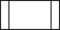 | **已定义过程**<br />Predefined Process | 用一个有2条左右垂直线长方型，来表示一个已在其他地方定义了的过程。 |
|           | **同页参考**<br />On-page Connector    | 用一个含有字母的小圆圈来连接目标流程画于同一页上。           |
|  | **换页参考**<br />Off-page Connector   | 用一个倒画的屋型来表示目标流程画于另一页上。                 |

----

## 1.2 绘制Markdown流程图简介

我们在撰写Markdown文档时，有时可能需要用到流程图。常规做法是首先利用流程图软件（如Visio、亿图等）画好流程图并导出图片文件，然后再在Markdown文档中插入相关流程图图片文件。实际上在Markdown中是可以直接用代码就能绘制出流程图的，可以不用额外插入外部图片，进而减少文件大小。当然，刚开始用代码绘制Markdown流程图可能会麻烦些，需要一个学习过程，但是等掌握了相关语法后，就能熟练地绘制出满足需要的流程图。

绘制Markdown流程图通常可以采用如下两种方式：

- 方法一、利用`flowchart.js`绘制流程图

```markdown
​```flow
	流程图代码块
​```
```

- 方法二、利用`mermaid`绘制流程图

```markdown
​```mermaid
	流程图代码块
​```
```

---

## 1.3 利用flowchart.js绘制流程图

Draws simple SVG flow chart diagrams from textual representation of the diagram.

有关更多详细信息，请参见：http://flowchart.js.org/

---

### 1.3.1 语法Syntax

利用  [flowchart.js](http://flowchart.js.org/) 插件实现绘制流程图。

```markdown
​```flow
	流程图代码块
​```
```

`流程图代码块`的语法分为两部分：

- 第一部分用来**定义流程图元素**。
- 第二部分用来**连接流程图元素**，指定流程图的执行走向。

---

#### 一、定义流程图元素

**（1）定义元素语法：**  

```markdown
tag=>type: content:>url
```

**（2）定义元素语法说明：**

|    元素     | 说明                                                         |
| :---------: | ------------------------------------------------------------ |
|    `tag`    | 流程图中的标签，在第二部分连接流程图元素时会用到。<br />名称可以任意，一般为流程的英文缩写和数字的组合。 |
|  `=>type`   | 用来确定标签的类型。`=>`后面的`type`表示类型。<br />由于标签名称可以任意指定，故需要依赖`type`来确定标签的类型。<br />共6种类型：start、end、operation、subroutine、condition、inputoutput<br /> |
| `: content` | 流程图文本框中的描述内容。<br />`:`后面`content`表示内容，中英文均可。<br />`:`与`content`之间一定要有一个空格，否则会出问题！ |
|   `:>url`   | `url`是一个链接，与流程图文本框中的文本相绑定。<br />`:>`后面就是对应的url链接，点击该文本时可通过链接跳转到url指定页面。 |

**（3）定义元素语句示例**：

```markdown
st=>start: 开始|past:>http://www.baidu.com
e=>end: 结束:>http://www.baidu.com
op=>operation: 我的操作
cond=>condition: yes or no?
sub=>subroutine: SubRoutine
```

----

#### 二、连接流程图元素

**（1）连接元素语法：**

```markdown
tag1(direction)->tag2
```

**（2）连接元素语法说明：**

| 元素           | 说明                                                         |
| -------------- | ------------------------------------------------------------ |
| `tag1`、`tag2` | 被连接的两个元素                                             |
| `(direction)`  | 可以指定元素之间连接的分支走向。<br />共4种走向：top、bottom、left、right，默认是向下。 |

==对于condition类型，有yes和no两个分支，这两个分支要各自单独写一行。==

如果要指定condition类型元素的yes分支走向向右，可以如：`cond(yes, right)->tag2`

**（3）连接元素语句示例：**

```markdown
st(right)->op(bottom)->cond
cond(yes)->e
cond(no, right)->sub(top)->op
```

---

**上述第一、二部分结合起来的简单示例**：

在`flow代码块`中间，先定义流程图元素，再根据需要连接流程图元素：

```markdown
​```flow
    st=>start: 开始|past:>http://www.baidu.com
    e=>end: 结束:>http://www.baidu.com
    op=>operation: 我的操作
    cond=>condition: yes or no?
    sub=>subroutine: SubRoutine

    st(right)->op(bottom)->cond
    cond(yes)->e
    cond(no, right)->sub(top)->op
​```
```

就可以实现一个简单的流程图了，如下：

```flow
st=>start: 开始|past:>http://www.baidu.com
e=>end: 结束:>http://www.baidu.com
op=>operation: 我的操作
cond=>condition: yes or no?
sub=>subroutine: SubRoutine

st(right)->op(bottom)->cond
cond(yes)->e
cond(no, right)->sub(top)->op
```

----

### 1.3.2 样例Example

#### 样例1 - 简单流程图

~~~markdown
```flow
    st=>start: Start:>http://www.google.com[blank]
    e=>end:>http://www.google.com
    op1=>operation: My Operation
    sub1=>subroutine: My Subroutine
    cond=>condition: Yes
    or No?:>http://www.google.com
    io=>inputoutput: catch something...
    para=>parallel: parallel tasks

    st->op1->cond
    cond(yes)->io->e
    cond(no)->para
    para(path1, bottom)->sub1(right)->op1
    para(path2, top)->op1
```
~~~

<span style='color:green'>上述代码块会自动被flowchart.js解析和渲染，经渲染后的流程图显示效果如下：</span>

```flow
st=>start: Start:>http://www.google.com[blank]
e=>end:>http://www.google.com
op1=>operation: My Operation
sub1=>subroutine: My Subroutine
cond=>condition: Yes or No?:>http://www.google.com
io=>inputoutput: catch something...
para=>parallel: parallel tasks

st->op1->cond
cond(yes)->io->e
cond(no)->para
para(path1, bottom)->sub1(right)->op1
para(path2, top)->op1
```


---

#### 样例2 - 带颜色块的流程图

~~~markdown
```flow
    st=>start: Start|past:>http://www.google.com[blank]
    e=>end: End|future:>http://www.google.com
    op1=>operation: My Operation|past
    op2=>operation: Stuff|current
    sub1=>subroutine: My Subroutine|invalid
    cond=>condition: Yes
    or No?|approved:>http://www.google.com
    c2=>condition: Good idea|rejected
    io=>inputoutput: catch something...|future

    st->op1(right)->cond
    cond(yes, right)->c2
    cond(no)->sub1(left)->op1
    c2(yes)->io->e
    c2(no)->op2->e
```
~~~

<span style='color:green'>上述代码块会自动被flowchart.js解析和渲染，经渲染后的流程图显示效果如下：</span>(==Typora上不能显示颜色块??==)

```flow
st=>start: Start|past:>http://www.google.com[blank]
e=>end: End|future:>http://www.google.com
op1=>operation: My Operation|past
op2=>operation: Stuff|current
sub1=>subroutine: My Subroutine|invalid
cond=>condition: Yes
or No?|approved:>http://www.google.com
c2=>condition: Good idea|rejected
io=>inputoutput: catch something...|future

st->op1(right)->cond
cond(yes, right)->c2
cond(no)->sub1(left)->op1
c2(yes)->io->e
c2(no)->op2->e
```

----

####  样例3 - 复杂流程图

~~~gfm
```flow
    st=>start: Improve your
    l10n process!
    e=>end: Continue to have fun!:>https://youtu.be/YQryHo1iHb8[blank]
    op1=>operation: Go to locize.com:>https://locize.com[blank]
    sub1=>subroutine: Read the awesomeness
    cond(align-next=no)=>condition: Interested to
    getting started?
    io=>inputoutput: Register:>https://www.locize.io/register[blank]
    sub2=>subroutine: Read about improving
    your localization workflow
    or another source:>https://medium.com/@adrai/8-signs-you-should-improve-your-localization-process-3dc075d53998[blank]
    op2=>operation: Login:>https://www.locize.io/login[blank]
    cond2=>condition: valid password?
    cond3=>condition: reset password?
    op3=>operation: send email
    sub3=>subroutine: Create a demo project
    sub4=>subroutine: Start your real project
    io2=>inputoutput: Subscribe

    st->op1->sub1->cond
    cond(yes)->io->op2->cond2
    cond2(no)->cond3
    cond3(no,bottom)->op2
    cond3(yes)->op3
    op3(right)->op2
    cond2(yes)->sub3
    sub3->sub4->io2->e
    cond(no)->sub2(right)->op1
    st@>op1({"stroke":"Red"})@>sub1({"stroke":"Red"})@>cond({"stroke":"Red"})@>io({"stroke":"Red"})@>op2({"stroke":"Red"})@>cond2({"stroke":"Red"})@>sub3({"stroke":"Red"})@>sub4({"stroke":"Red"})@>io2({"stroke":"Red"})@>e({"stroke":"Red","stroke-width":6,"arrow-end":"classic-wide-long"})
```
~~~

<span style='color:green'>上述代码块会自动被flowchart.js解析和渲染，经渲染后的流程图显示效果如下：</span>

```flow
st=>start: Improve your
l10n process!
e=>end: Continue to have fun!:>https://youtu.be/YQryHo1iHb8[blank]
op1=>operation: Go to locize.com:>https://locize.com[blank]
sub1=>subroutine: Read the awesomeness
cond(align-next=no)=>condition: Interested to
getting started?
io=>inputoutput: Register:>https://www.locize.io/register[blank]
sub2=>subroutine: Read about improving
your localization workflow
or another source:>https://medium.com/@adrai/8-signs-you-should-improve-your-localization-process-3dc075d53998[blank]
op2=>operation: Login:>https://www.locize.io/login[blank]
cond2=>condition: valid password?
cond3=>condition: reset password?
op3=>operation: send email
sub3=>subroutine: Create a demo project
sub4=>subroutine: Start your real project
io2=>inputoutput: Subscribe

st->op1->sub1->cond
cond(yes)->io->op2->cond2
cond2(no)->cond3
cond3(no,bottom)->op2
cond3(yes)->op3
op3(right)->op2
cond2(yes)->sub3
sub3->sub4->io2->e
cond(no)->sub2(right)->op1

st@>op1({"stroke":"Red"})@>sub1({"stroke":"Red"})@>cond({"stroke":"Red"})@>io({"stroke":"Red"})@>op2({"stroke":"Red"})@>cond2({"stroke":"Red"})@>sub3({"stroke":"Red"})@>sub4({"stroke":"Red"})@>io2({"stroke":"Red"})@>e({"stroke":"Red","stroke-width":6,"arrow-end":"classic-wide-long"})
```

----

## 1.4 利用mermaid绘制流程图

Mermaid的流程图主要是由**节点**加**连线**的形式形成。

有关更多详细信息，请参见：https://mermaid-js.github.io/mermaid/#/flowchart

---

### 1.4.1 基本语法 - Graph

Mermaid通过如下语法声明一个新图和图布局的方向：

```markdown
​```mermaid
graph 方向描述
	图中其他语句
​```
```

其中“方向描述”取值如下表：

| 取值 | 含义                                  |
| :--: | ------------------------------------- |
|  TB  | 表示从顶向底（Top to Bottom）         |
|  TD  | 表示从上向下（Top to Down），跟TB相同 |
|  BT  | 表示从底向顶（Bottom to Top）         |
|  LR  | 表示从左向右（Left to Right）         |
|  RL  | 表示从右向左（Right to Left）         |

**示例**：

```markdown
​```mermaid
graph LR
	Start-->Stop
​```	
```

`LR`渲染效果：

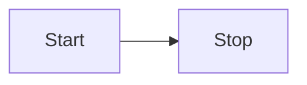

----

```markdown
​```mermaid
graph RL
	Start-->Stop
​```	
```

`RL`渲染效果：

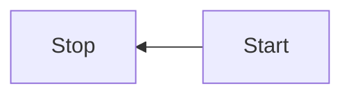

----

```markdown
​```mermaid
graph TB
	Start-->Stop
​```	
```

`TB`渲染效果：

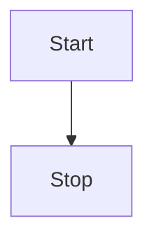

----

```markdown
​```mermaid
graph BT
	Start-->Stop
​```	
```

`BT`渲染效果：

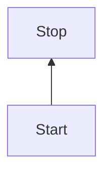

----

### 1.4.2 基本语法 - 节点和形状

#### 1.4.2.1 节点概念

节点即流程图中每个文本块，包括开始、结束、处理、判断等。Mermaid 中每个节点都有一个 id，以及节点的文字。

> 注1：如果节点的文字中包含标点符号，需要用双引号包裹起来。
> 注2：如果希望在文字中使用换行，请使用替换换行。

---

#### 1.2.4.2 节点形状

节点可以不同符号组合包裹描述词来表示不同的节点形状，具体如下：

|     节点表述     | 说明           | 节点表述         | 说明           |
| :--------------: | -------------- | ---------------- | -------------- |
|       `id`       | 缺省节点       | `id>节点内容]`   | 非对称形状节点 |
|  `id[节点内容]`  | 矩形节点       | `id(节点内容)`   | 圆角矩形节点   |
| `id((节点内容))` | 圆形节点       | `id{节点内容}`   | 菱形节点       |
| `id[/节点内容/]` | 平行四边形节点 | `id[\节点内容\]` | 平行四边形节点 |
| `id[/节点内容\]` | 正梯形节点     | `id[\节点内容/]` | 反梯形节点     |
| `id{{节点内容}}` | 六角形节点     | `id[(节点内容)]` | 圆柱状节点     |
| `id([节点内容])` | 体育场形状节点 | `id[[节点内容]]` | 子例程形状节点 |

#### 1.4.2.3 节点示例

```markdown
​```mermaid
graph TB
	A
	B[矩形节点]
	C(圆角矩形节点)
	D>非对称形状节点]
	E((圆形节点))
	F{菱形节点}
	G{{六角形节点}}
	H[\平行四边形节点\]
	I[/平行四边形节点/]
	J[/梯形节点\]
	K[\梯形节点/]
    L[(圆柱状节点)]
    M([体育场形状节点])
    N[[子例程形状节点]]
​```
```

渲染后的效果：（==Typora中上表最后3种形状的节点暂不支持？？==）

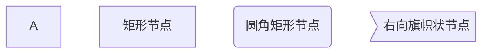

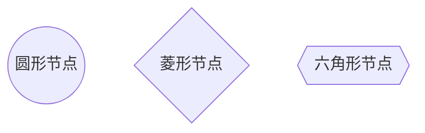

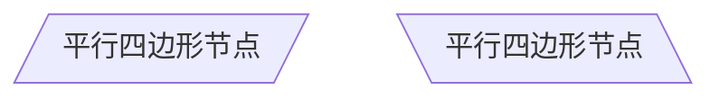

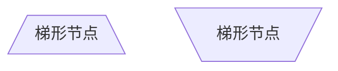

---

#### 1.4.2.4 节点文本 - 破坏语法的特殊字符

可以将文本放在引号中，以呈现更麻烦的字符。如下例所示：

```markdown
​```mermaid
graph LR
    id1["这是含有特殊字符('Text')的节点内容！"]
​```    
```

渲染后的显示效果：

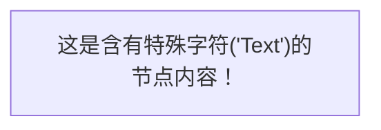

----

#### 1.4.2.5 节点文本 - HTML的转义字符

可以使用此处说明的语法对字符进行转义。

```markdown
​```mermaid
graph LR
    A["双引号: #quot;"] --> B["转义字符: #9829;"]
​```    
```

渲染后的显示效果：


----

### 1.4.3 基本语法 - 节点间的连线

#### 1.4.3.1 连线概念

节点之间可以使用线或边进行连接。mermaid支持多种不同类型的连线，也可以在连线上附加文本。

连线是在流程图中，将两个节点连接起来的线。连线可以添加方向、备注等信息，增加流程图的可读性。

----

#### 1.4.3.2 连线类型

| 符号  |      含义      |    符号    |     含义     |
| :---: | :------------: | :--------: | :----------: |
|  `-`  | 不添加尾部箭头 |    `>`     | 添加尾部箭头 |
| `--`  |      单线      | `--标注--` | 单线上加标注 |
| `-.-` |      虚线      | `-.标注.-` | 虚线上加标注 |
| `==`  |      粗线      | `==标注==` | 粗线上加标注 |

| 连线类型 |     说明     | 连线类型 |     说明     |
| :------: | :----------: | :------: | :----------: |
| `A---B`  | 无箭头细实线 | `A-->B`  | 有箭头细实线 |
| `A-.-B`  | 无箭头细虚线 | `A-.->B` | 有箭头细虚线 |
| `A===B`  | 无箭头粗实线 | `A==>B`  | 有箭头粗实线 |

**连线类型示例**：

```markdown
​```mermaid
graph TB
	A1---B1
	A2-->B2
	A3-.-B3
	A4-.->B4
	A5===B5
	A6==>B6
​```	
```

渲染后的显示效果：（==Typora上无箭头粗实线和有箭头粗实线不能正常显示==）

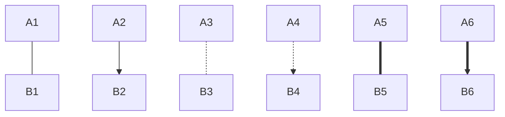

---

#### 1.4.3.3 连线标注

添加连线标注的方法有两种：

- 在连线之间添加，如：`A --标注--- B` 
- 在连线尾部添加，如：`A ---|标注| B`

| 连线标注类型                     | 说明                 | 连线标注类型  | 说明                 |
| -------------------------------- | -------------------- | ------------- | -------------------- |
| `A--标注---B`<br />`A---|标注|B` | 带标注的无箭头细实线 | `A-->|标注|B` | 带标注的有箭头细实线 |
| `A-.标注.-B`                     | 带标注的无箭头细虚线 | `A-.标注.->B` | 带标注的有箭头细虚线 |
| `A-=标注===B`                    | 带标注的无箭头粗虚线 | `A==标注==>B` | 带标注的有箭头粗虚线 |

----

**连线标注示例**：

```markdown
​```mermaid
graph TB
	C1--标注1---D1
	C2-.标注2.-D2
	C3-->|标注3|D3
	C4-.标注4.->D4
	C5==标注5===D5
	C6==标注6==>D6
​```
```

渲染后的显示效果：（==Typora上带标注的无箭头粗实线和有箭头粗实线不能正常显示==）

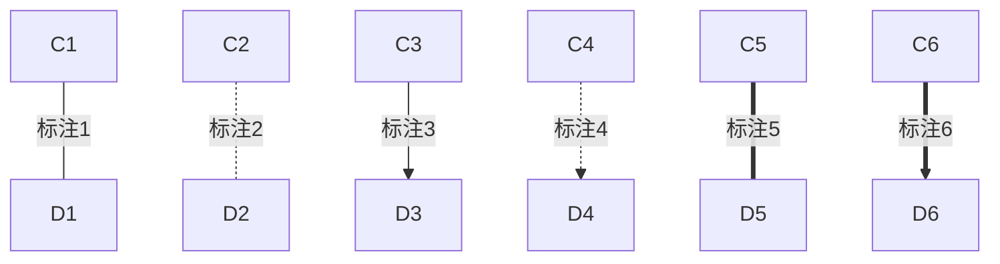

---

#### 1.4.3.4 链连接

可以按如下所示在同一行中声明许多连线：

```markdown
​```mermaid
graph LR
   A -- text --> B -- text2 --> C
​```   
```

渲染后的效果：

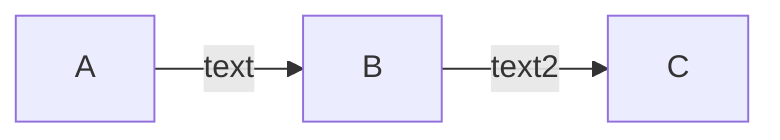

----

也可以按照以下方式在同一行中声明多个节点：

```markdown
​```mermaid
graph LR
	A-->B & C-->D
​```   
```

渲染后的效果：（==TyPora上显示不出来？？，下面是截图==）

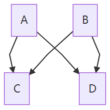

----

### 1.4.4 基本语法 - 子图

#### 1.4.4.1 子图概念及语法

子图是流程图中的部分流程的合集整理，可以多个子图进行嵌套。

子图的实现方法是将需要作为一个合集的节点包裹在`subgraph #子图名称 ... end` 中，如下

使用以下语法添加子图：

```markdown
subgraph 子图名称
    子图中的描述语句...
end
```

----

#### 1.4.4.2 子图示例

##### 子图示例1

```markdown
​```mermaid
graph TB
    c1-->a2
    subgraph one
    	a1-->a2
    end
    subgraph two
    	b1-->b2
    end
    subgraph three
    	c1-->c2
    end
​```
```

渲染后的显示效果：

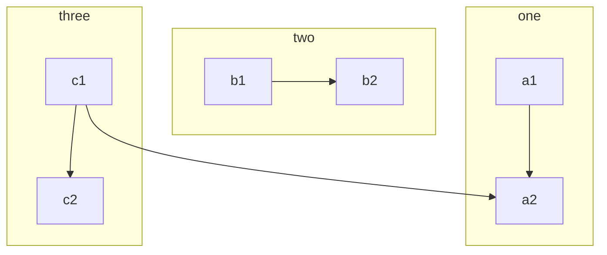

-----

##### 子图示例2

还可以为子图设置专有ID。

```markdown
graph TB
    c1-->a2
    subgraph ide1 [one]
    	a1-->a2
    end
```

渲染后的显示效果：

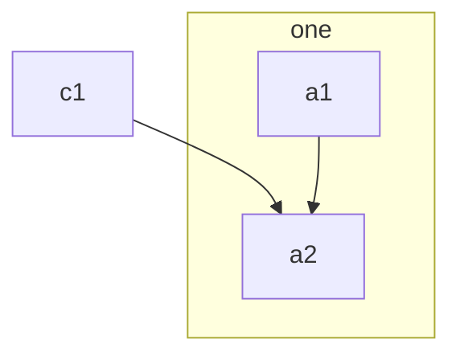

---

### 1.4.5 基本语法 - 样式和类

虽然Mermaid在主题中提供了系统的样式，但我们在实际使用中，为了区别个别节点或者连线，需要对节点和连线的样式做自定义操作。

#### 1.4.5.1 节点样式

可以对节点的线框、线型、背景色、文字颜色等进行自定义。节点样式的语法为：

```markdown
style id style1,style2,style3,...
```

节点样式示例：

```markdown
style id2 fill:#bbf,stroke:#f66,stroke-width:2px,color:#fff,stroke-dasharray: 5, 5
```

节点样式示例说明：可以设置节点背景，边框颜色，粗细，实线还是虚线

| 项                     | 说明             |
| ---------------------- | ---------------- |
| style                  | 节点样式关键字   |
| id2                    | 节点ID           |
| fill:#bbf,             | 节点背景色：     |
| stroke:#f66,           | 边框颜色：       |
| stroke-width:2px,      | 边框宽度：2px    |
| color:#fff,            | 节点内容字体颜色 |
| stroke-dasharray: 5, 5 | 边框断点：       |

可以将特定样式（例如较粗的边框或不同的背景颜色）应用于节点。

```markdown
graph LR
    id1(Start)-->id2(Stop)
    style id1 fill:#f9f,stroke:#333,stroke-width:4px
    style id2 fill:#bbf,stroke:#f66,stroke-width:2px,color:#fff,stroke-dasharray: 5, 5
```

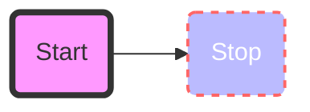

---

#### 1.4.5.2 连线样式

连线不像节点存在id，无法通过具体id来定位。Mermaid通过给连线标序号来替代id，进而定位连线。第一条连线定位为`linkStyle 0` ，第二条连线定位为`linkStyle 1` 以此类推。连线样式的语法为:

```markdown
linkStyle 1 style1,style2,style3,...
```

linkStyle 后面的数字表示第几根线，从 0 开始。可以指定颜色和粗细。

**连线样式示例**：

```markdown
​```mermaid
graph LR;
    A-->B;
    A-->C;
    B-->D;
    C-->D;
    linkStyle 0 stroke:#0ff,stroke-width:2px;
    linkStyle 3 stroke:#f03,stroke-width:4px;
​```    
```

渲染后的连线样式示例显示效果：

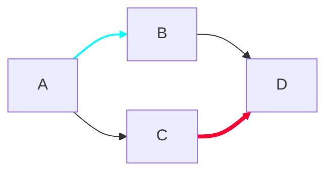

---

#### 1.4.5.3 样式类

##### 自定义样式类

为了方便样式的使用，可以定义类来使用样式。

类的定义示例：

```
classDef className fill:#f9f,stroke:#333,stroke-width:4px;
```

对节点nodeId使用样式类className：

```
class nodeId className;
```

同时对多个节点使用相同的样式类className：

```
class nodeId1,nodeId2 className;
```

可以在CSS中提前定义样式类，应用在图的定义中。

---

**自定义样式类示例**：

~~~markdown
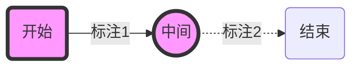
~~~

渲染后的显示效果：


----

##### 默认样式类

当没有指定样式的时候，默认采用。

```
classDef default fill:#f9f,stroke:#333,stroke-width:4px;
```

**默认样式类示例**：

~~~markdown

~~~

渲染后的显示效果（==未能正常显示？？==）：

```mermaid
graph LR
	classDef myclass fill:#f90,stroke:#555,stroke-width:4px;
	id1(Start)-->id2(Stop)
```

-----

### 1.4.6 基本语法 - 交互

流程图可以给节点绑定**点击事件**和**js触发事件**。

点击事件绑定语法为：`click nodeId “URL”` ;

JS触发事件语法为：`click nodeId callback Function` ;

流程图示例如下图：点击B节点，新窗口打开设置好的页面；

```mermaid
graph LR
	A-->B[点击本节点在新窗口打开文件]
    click B "MyLN_Typora.md"
```

实现代码如下：

~~~markdown
```mermaid
graph LR
	A-->B[点击本节点在新窗口打开文件]
    click B "MyLN_Typora.md"
```    
~~~

----

### 1.4.7 基本语法 - 注释

可以在流程图中输入注释，解析器将忽略它们。注释必须自己一行，并且必须以`%%`（双百分号）开头。注释开始到下一个换行符之后的所有文本（包括任何流程图语法）都将被视为注释。

~~~markdown
```mermaid
graph LR
%% 这是一段注释 A -- 标注 --> B{node}
   A -- 标注1 --> B -- 标注2 --> C
```   
~~~

渲染后的效果：

```mermaid
graph LR
%% 这是一段注释 A -- 标注 --> B{node}
   A -- 标注1 --> B -- 标注2 --> C
```

----

### 1.4.8 基本语法 - 图标

节点中可以使用 [Font Awesome](https://fontawesome.com/) 图标。参见fontawesome中文网址：http://www.fontawesome.com.cn/。

语法 `fa:icon class name`。

~~~markdown
```mermaid
graph TD
    B{"fa:fa-twitter 和平"}
    B-->C[fa:fa-ban 禁止]
    B-->D((fa:fa-spinner));
    B-->E(A fa:fa-camera-retro 也许?);
```    
~~~

渲染后的显示效果【==图标未显示出来？？==】：

```mermaid
graph TD
    B{"fa:fa-twitter 和平"}
    B-->C[fa:fa-ban 禁止]
    B-->D((fa:fa-spinner));
    B-->E(A fa:fa-camera-retro 也许?);
```

---

### 1.4.2 样例

#### 1.4.2.1 绘制横向流程图样例

代码块：

```markdown
​```mermaid
graph LR
	A[方形] -->|标注| B(圆角)
    B --> C{条件a}
    C -->|a=1| D[结果1]
    C -->|a=2| E[结果2]
	F[横向流程图]
​```
```

渲染后的显示效果：

```mermaid
graph LR
	A[方形] -->|标注| B(圆角)
    B --> C{条件a}
    C -->|a=1| D[结果1]
    C -->|a=2| E[结果2]
	F[横向流程图]
```

----

#### 1.4.2.2 绘制竖向流程图样例

代码块：

```markdown
​```mermaid
graph TD
	A[方形] --> B(圆角)
    B --> C{条件a}
    C --> |a=1| D[结果1]
    C --> |a=2| E[结果2]
    F[竖向流程图]
​```
```

渲染后的显示效果：

```mermaid
graph TD
	A[方形] --> B(圆角)
    B --> C{条件a}
    C --> |a=1| D[结果1]
    C --> |a=2| E[结果2]
    F[竖向流程图]
```
