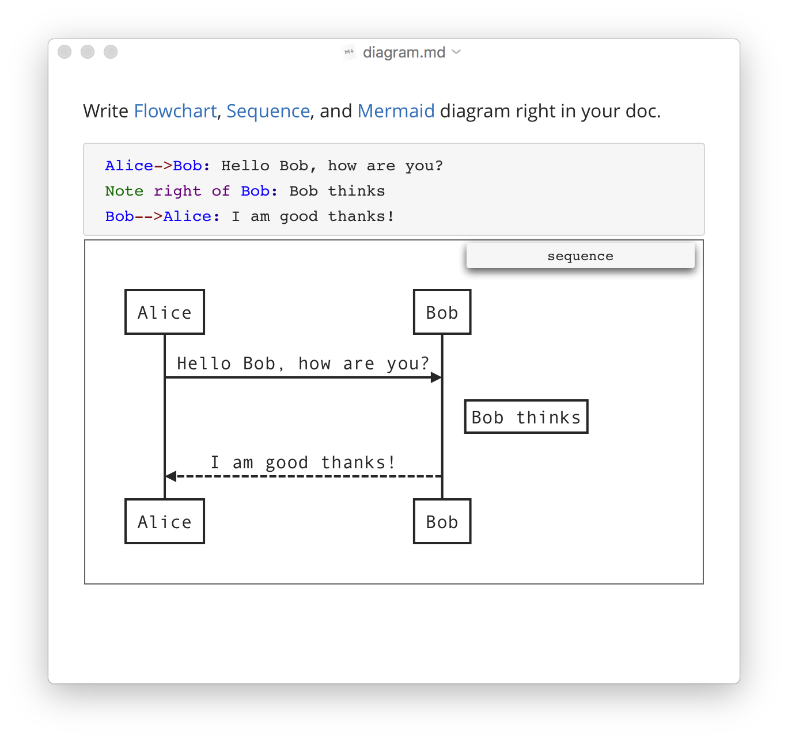
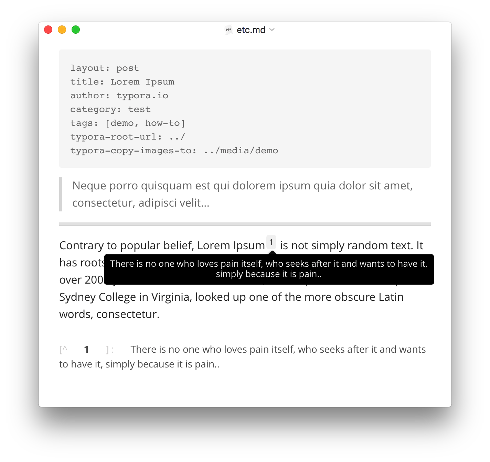
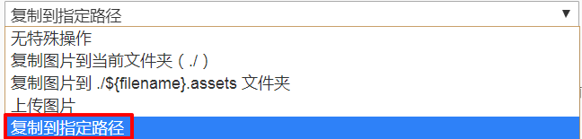

# <center>Typora学习笔记</center>


<center>文档历史记录</center>

----

| 版本 |        | 作者     | 日期       | 说明                                                         |
| ---- | ------ | -------- | ---------- | ------------------------------------------------------------ |
| V0.1 | 初稿   | Jiang Su | 2020-03-15 | 构建文档架构<br />撰写第1章-简介<br />撰写第2章-安装配置<br />撰写第3章-软件说明 |
| V0.2 | 初稿   | Jiang Su | 2020-05-23 | 撰写第4章-语法使用                                           |
| V0.3 | 修订稿 | Jiang Su | 2020-07-04 | 添加第0章-参考资料<br />修订第1章-简介                       |


----

## 0. 参考资料

| 网址                                          | 说明                          |
| --------------------------------------------- | ----------------------------- |
| https://en.wikipedia.org/wiki/Markdown        | 维基百科Markdown词条          |
| https://daringfireball.net/projects/markdown/ | Markdown原始官网              |
| https://spec.commonmark.org/                  | CommonMark Spec               |
| https://github.github.com/gfm/                | GitHub Flavored Markdown Spec |
| https://typora.io/                            | Typora Website                |
| http://support.typora.io/                     | Typora Website 文档页面       |


------

## 1. 简介

### 1.1 Markdown

#### 1.1.1 Markdown概述

**Markdown**是一种[轻量级标记语言](https://zh.wikipedia.org/wiki/轻量级标记语言)，创始人为[约翰·格鲁伯](https://zh.wikipedia.org/wiki/約翰·格魯伯)（John Gruber）。它允许人们使用易读易写的纯文本格式编写文档，然后转换成有效的[XHTML](https://zh.wikipedia.org/wiki/XHTML)（或者[HTML](https://zh.wikipedia.org/wiki/HTML)）文档。这种语言吸收了很多在[电子邮件](https://zh.wikipedia.org/wiki/电子邮件)中已有的纯文本标记的特性。     ——来自《维基百科》

由于Markdown的轻量化、易读易写特性，并且对于图片、图表、数学式都有支持，目前许多网站都广泛使用Markdown来撰写帮助文档或是用于[论坛](https://zh.wikipedia.org/wiki/网络论坛)上发表消息。如[GitHub](https://zh.wikipedia.org/wiki/GitHub)、[Reddit](https://zh.wikipedia.org/wiki/Reddit)、[Diaspora](https://zh.wikipedia.org/wiki/Diaspora)、[Stack Exchange](https://zh.wikipedia.org/wiki/Stack_Exchange)、[OpenStreetMap](https://zh.wikipedia.org/wiki/OpenStreetMap) 、[SourceForge](https://zh.wikipedia.org/wiki/SourceForge)、[简书](https://zh.wikipedia.org/wiki/简书)等，甚至还能被使用来撰写[电子书](https://zh.wikipedia.org/wiki/電子書)。 

Markdown与其他许多轻量级标记语法（通常更易于编写）的区别在于其可读性。正如[约翰·格鲁伯](https://zh.wikipedia.org/wiki/約翰·格魯伯)（John Gruber）写道：

> Markdown格式化语法的首要设计目标是使其更具可读性。这个想法是Markdown格式的文档应该以纯文本的形式原样发布，而不会看起来像被标签或格式说明所标记。


---

#### 1.1.2 Markdown发展

**==Markdown==**由 John Gruber（在Aaron Swartz的帮助下）开发，并于2004年以[语法描述](http://daringfireball.net/projects/markdown/syntax)和Perl脚本（`Markdown.pl`）的形式发布。

---

在接下来的十年中，Markdown已经成为典型的转换为HTML的非正式规范和参考实现。到2014年，以多种语言实现了数十种Markdown实现。但因 John Gruber 对Markdown语法的[规范描述](https://daringfireball.net/projects/markdown/syntax)并未明确指定语法，故各种实现的语法因不同的解析器或编辑器而异。这些实现中，有些扩展了原始Markdown语法，并增加了脚注、表格和其他文档元素的约定；有些允许Markdown文档以HTML以外的格式呈现。Markdown开始在网络之外用于撰写书籍、文章、幻灯片、信件和讲义。

---

从2012年开始，包括 Jeff Atwood 和 John MacFarlane 在内的一群人启动了标准化工作。==**CommonMark**==为Markdown提出了一个标准，明确的语法规范，并提供了一套全面的测试来验证针对该规范的Markdown实现。CommonMark.org发布了CommonMark规范`CommonMark Spec`（网址：https://spec.commonmark.org/）、参考实现和测试包的几个版本。

---

2017年，GitHub发布了基于CommonMark规范的**==GitHub Flavored Markdown（简称GFM）==**的正式规范`GitHub Flavored Markdown Spec`（网址：https://github.github.com/gfm/）。GFM规范定义了语法和语义。GFM是CommonMark的strict超集。GFM规范在遵循CommonMark规范的基础上添加了相关扩展（如：表格、删除线、自动链接和任务列表）。

----

**==Typora==**是一款基本遵循`GitHub Flavored Markdown Spec`的实现工具（轻量级Markdown编辑器）。


------

### 1.2 Typora

#### 1.2.1 Typora简介

**Typora**是一款由**Abner Lee**开发的**轻量级Markdown编辑器**，适用于Windows、Linux和Mac三种操作系统。Typora**支持即时渲染技术**，即时渲染使得你写Markdown就象是写Word文档一样流畅自如。

> 注：Typora是一款商业软件, 目前处于Beta测试阶段，所有人均可免费使用（但正式版发布后可能会收费）。

与其他Markdown编辑器最显著的区别是，Typora没有采用源代码和预览双栏显示的方式，而是采用**所见即所得**的编辑方式，实现了即时预览的功能，但也可切换至源代码编辑模式。

在编辑时，除了通过传统的Markdown代码的方式来实现富文本之外，Typora支持通过菜单栏或者鼠标右键选取命令的方式来实现富文本，也支持通过快捷键的方式插入。Typora也支持通过以[TeX](https://zh.wikipedia.org/wiki/TeX)的格式来插入行间公式和行内公式。在完成编辑后导出文件时，Typora支持以PDF、HTML、Word(.docx)、OpenOffice、RTF、Epub、LaTeX、MediaWiki、reStructuredText、Textile和OPML的形式导出。在定制方面，Typora提供有几种主题，并支持通过自定义CSS的方式进行个性化定制。


------

#### 1.2.2 Typora特性

##### 1.2.2.1 可读可写(==Readable & Writable==)

Typora将为您提供既是读者又是作家的无缝体验。它删除了预览窗口，模式切换器，`Markdown`源代码的语法符号以及所有其他不必要的干扰。相反，它提供了真正的实时预览功能，可帮助您专注于内容本身。

- **Distractions Free**
- **无缝实时预览Seamless Live Preview**<br />
- **所见即所得What You See Is What You Mean**


------

##### 1.2.2.2 简单而强大(==Simple, yet Powerful==)

|         对象          | 图示及说明                                                   |
| :-------------------: | ------------------------------------------------------------ |
|    ==**Images**==     |       |
|                       | **支持相对路径Support Relative Path:**<br />    当处理本地图像文件的相对路径时，可以将其基本路径设置为指向静态博客的根文件夹。<br />--------------------------------------------------------------------------------<br />**上传图片Upload Images:**<br />    共享markdown文件附带的图片不再麻烦。在macOS上通过集成iPic Service，可以将图像上传到的云服务器。<br />--------------------------------------------------------------------------------<br />**拖放Drag & Drop:**<br />    通过拖放操作，插入图像将非常容易。<br />--------------------------------------------------------------------------------<br />**调整图片大小Resize Images:**<br />    难以显示正确尺寸的retina图片吗？Typora支持具有自定义尺寸或缩放系数的标签。 |
|                       |                                                              |
|    ==**Headers**==    |         |
|                       | **目录Table of Contents:**<br />    输入`[TOC]`以插入目录，所有标题都将在此处列出。<br />--------------------------------------------------------------------------------<br />**自定义格式Customized Styles:**<br />    使用您自己的CSS代码来更改字体大小、对齐方式，[自动编号标题](http://support.typora.io/Auto-Numbering/)。<br />--------------------------------------------------------------------------------<br />**内部链接Internal Links:**<br />    将href设置为标题，这将创建一个书签，允许您单击后跳至该部分。 |
|                       |                                                              |
|     ==**Lists**==     |       |
|                       | **更改列表类型Change List Type:**<br />    使用快捷键，上下文菜单或触摸栏将列表类型从一种更改为另一种。<br />--------------------------------------------------------------------------------<br />**缩进Indent/Outdent:**<br />    按`Tab`和`Shift + Tab`键，像富编辑器一样排列嵌套列表。<br />--------------------------------------------------------------------------------<br />**任务Tasks:**<br />    支持GFM任务列表。能够在markdown文件中管理简单的待办事项。 |
|                       |                                                              |
|    ==**Tables**==     |       |
|                       | **轻松调整大小Easy Resize:**<br />    调整Markdown文件中表格大小的最快步骤：只需拖动鼠标即可。<br />--------------------------------------------------------------------------------<br />**快速重排序Quick Reorder:**<br />--------------------------------------------------------------------------------<br />**插入表格Insert Tables:**<br />    使用快捷键生成具有给定布局的表格。也支持直接输入markdown。 |
|                       |  |
|                       |                                                              |
|  ==**Code Fences**==  |      |
|                       | **行号Line Numbers:**<br /><br />可以在首选项面板中打开显示行号。<br />--------------------------------------------------------------------------------<br />**语法高亮Syntax Highlight:**<br /><br />Typora支持大约100种语言的语法高亮显示，涵盖所有常见的编程语言。 |
|                       |                                                              |
|  ==**Mathematics**==  |        |
|                       | **实时预览Live Preview:**<br /><br />    键入时预览。<br />--------------------------------------------------------------------------------<br />**化学方程式Chemical Equation:**<br />    大多数MathJax扩展内置，包括[mhchem](http://docs.mathjax.org/en/latest/tex.html#mhchem), [AMSmath](http://docs.mathjax.org/en/latest/tex.html#amsmath-and-amssymbols), [BBox](http://docs.mathjax.org/en/latest/tex.html#bbox), etc.<br />--------------------------------------------------------------------------------<br />**公式自动编号Auto Numbering:**<br />    自动为数学方程式编号（在偏好设置面板中启用）。 |
|                       |                                                              |
|   ==**Diagrams**==    |     |
|                       | **流程图Flowchart:**<br />    绘制基于[flowchart.js](http://flowchart.js.org/)的简单SVG流程图 [流程图](http://flowchart.js.org/)。<br />--------------------------------------------------------------------------------<br />**Mermaid:**<br />    mermaid引擎生成流程图，序列，甘特图等。<br />--------------------------------------------------------------------------------<br />**时序图Sequence:**<br />    绘制简单的SVG时序图。<br />--------------------------------------------------------------------------------<br />**错误提示Error Hint:**<br /><br />    实时显示错误提示。 |
|                       |                                                              |
| ==**Inline Styles**== |      |
|                       | **快捷键Shortcut Keys:**<br /><br />    使用熟悉的快捷键。<br />--------------------------------------------------------------------------------<br />**表情符号Emoji:**<br /><br />通过自动完成输入所需的表情符号。<br />--------------------------------------------------------------------------------<br />**中日韩字符支持CJK Support:**<br />    所有样式都包括“Strong”和“emphasis”，可以在CJK字符集中正确呈现。<br />--------------------------------------------------------------------------------<br />**链接Links:**<br /><br />    将链接目标设置为标题，markdown文件或URL。 |
|                       |                                                              |
|      ==**etc**==      |         |
|                       | **Front Matter:**<br />    与包含YAML Front Matter的文件兼容。<br />--------------------------------------------------------------------------------<br />**块引用Blockquote:**<br />    使用email-style >字符进行块引用。<br />--------------------------------------------------------------------------------<br />**水平线Horizontal line:**<br />    CSS样式的水平线。<br />--------------------------------------------------------------------------------<br />**脚注Footnote:**<br />    显示您在悬停区域对应的脚注。 |

<center>/ * 有序，无序和任务列表 * /</center>
------

##### 1.2.2.3 无障碍(==Accessibility==)

<center>/ * 您专注于内容，TYPORA会为您提供帮助 * /</center>
| 组织文件Organize Files                                       | 导入导出Import & Export                                      |
| ------------------------------------------------------------ | ------------------------------------------------------------ |
| Typora提供文件树面板和文章（文件列表）面板，使您可以轻松管理文件。文件组织在文件夹中，使您可以使用自己的云服务（例如Dropbox）来同步文档。 | Typora可以导出带标签的PDF。通过集成Pandoc，可以导出或导入更多格式，包括docx，OpenOffice，LaTeX，MediaWiki，Epub等。 |
|       |  |
|                                                              |                                                              |
| **字数统计Word Count**                                       | **专注模式和打字机模式Focus Mode & TypeWriter Mode**         |
| 查看以字，字符，行或阅读分钟为单位的文档大小。               | 专注模式通过模糊其他线，可以帮助您仅聚焦于当前行。打字机模式将始终确保当前活动行在窗口中间。 |
|  |       |
|                                                              |                                                              |
| **轮廓面板Outline Panel**                                    | **自动配对Auto Pair**                                        |
| 文档的轮廓结构将在“轮廓”面板中提取，这使您可以快速浏览文档并一键跳到任何部分。 | 像代码编辑器一样自动完成一对括号和引号。此外，还提供了一个选项，用于自动配对Markdown符号，例如*或_。 |
|     |   |


------

##### 1.2.2.4 自定义主题(==Custom Themes==)

<center>/ * 可通过CSS完全配置 * /</center>


------

## 2. 安装配置

### 2.1 下载安装文件

在Typora官网：https://www.typora.io/  点击【Download】，根据操作系统以及系统架构选择下载相应的安装文件。

> 注：本文以64位Windows平台为例，安装文件为：`typora-setup-x64-v0.9.89beta.exe`。


------

### 2.2 安装操作步骤

​        Windows平台上安装非常简单，点击安装文件，按提示执行即可。具体步骤如下：


------

### 2.3 基本配置

#### 2.3.1 中文界面配置

**Step1**：打开**Typora**软件，点击菜单栏`File`—`Perference...`


**Step2**: 在弹出的`Perference`页面中，点击`General`，在右侧页面`Language`中选择`简体中文`或`System Language`，点击右上角的`X`保存设置。


**Step3**：语言设置需要**重启**应用程序后才生效。下图为重启`Typora`后的中文界面：


------

#### 2.3.2 图片相对路径设置

- **Step1:  Topyra工具设置**

打开`Typora`软件，点击菜单栏`File`—`偏好设置...`，在弹出的`偏好设置`页面中，点击左侧`图像`，在右侧页面`图像`中下拉框选择`复制到指定路径`-输入==需要自定义设置的图片相对路径==`./images`，并把下方的四个复选框均选中，点击右上角的`X`保存设置。


​    注：下拉框共有如下5种选择：




- **Step2: 实际插入图片操作**

  - **Step2-1**、首先需要保存相应的md文件名（如：`LN_Typora.md`）；
- **Step2-2**、在打开的Typora编辑器中通过菜单项`格式`—`图像`—`插入本地图片`
  
  
  
  - **Step2-3**、选择本地已经保存好的相应的图片
  
  
  
  - **Step2-4**、选择`缩放图片`-`具体比例（如50%）`----目的是对该图片能进行适当调整
  
  
  
  - **Step2-5**、调整缩放比例的源码：


- **Step3:  导出pdf，查看图片效果**

  - **Step3-1**、点击菜单栏`文件`-`导出`-`PDF`，在弹出的窗口中选择好导出文件存放路径，点击`保存`，在等待片刻后即可生成对应的PDF文件。打开pdf文件后查看图片显示正常。

  - **Step3-2**、把md文件连带相应的存放图片的img目录全部文件提交到Github，在Github上打开该.md文件查看正常图片显示正常。

```bash
# 进入需要提交的目录
$ cd XXX
$ git add -A
$ git commit -m "XXXXXX"
#git push <远程主机名> <本地分支名>:<远程分支名>
$ git push origin master
```

------

### 2.4 自定义主题

一般缺省选择`Github`主题（能成功导出显示效果较好的pdf文档）。可以基于`Github`主题进行修改定制。

- **Step1：**运行`Typora`软件，点击主菜单项`文件`下的子菜单项`偏好设置`，在`偏好设置——外观`页面下选择`打开主题文件夹`，进入主题所在目录（如：``C:\Users\jiangsu\AppData\Roaming\Typora\themes`）。


- **Step2：**通过编辑器打开`C:\Users\jiangsu\AppData\Roaming\Typora\themes\github.css`文件

- **Step3：**进行相应修改，比如对`code`样式进行修改（原样式显示效果不太明显）：

```css
/* 这是原始code样式 */
.md-fences,
code,
tt {
    border: 1px solid #e7eaed;
    background-color: #f8f8f8;
    border-radius: 3px;
    padding: 0;
    padding: 2px 4px 0px 4px;
    font-size: 0.9em;
}

code {
    background-color: #f3f4f4;
    padding: 0 2px 0 2px;
}
```

```css
/* 这是修订后的code样式 */
.md-fences,
code,
tt {
    border: 1px solid #e7eaed;
    background-color: #f8f8f8;
    border-radius: 3px;
    padding: 0;
    padding: 2px 4px 0px 4px;
    font-size: 0.9em;
}

code {
    color: #0a041a;               /* Added by JiangSu */
    border-color:  #f50f41;       /* Added by JiangSu */
    background-color: #f3f4f4;
    padding: 3px 4px 1px 4px;     /* Modified by JiangSu */
}
```

- **Step4：**保存`Github.css`文件，重新打开`Typora`程序即可生效。


------

## 3. 软件说明

### 3.1 快捷键

详细参见：http://support.typora.io/Shortcut-Keys/

------

### 3.2 文件管理

详细参见：http://support.typora.io/File-Management/

------

### 3.3 主题

详细参见：http://support.typora.io/About-Themes/


------

## 4. 语法使用

### 4.1 块元素

#### 4.1.1 段落和换行符

段落只是一行或多行连续的文本。在`Markdown`源代码中，段落由多个空行分隔。在Typora中，您只需按下 `Return` 即可创建新段落。

段落的前后要有空行，所谓的空行是指没有文字内容。若想在段内强制换行的方式是使用**两个以上**空格加上回车（引用中换行省略回车）。

按 `Shift` + `Return` 可创建单个换行符。但是，大多数`Markdown`解析器将忽略单行中断，要使其他`Markdown`解析器识别您的换行符，可以在行尾留下两个空格，或者插入 `<br/>`.

------

#### 4.1.2 标题__#

在Typora中，输入`#`后跟标题内容，按下 `Return` 键将创建标题。标题在行的开头使用1-6个`#`字符，对应于标题级别1-6。例如：

```markdown
# <div align='center'><span style='color:red'>一级标题居中红色</span></div>

# 一级标题      或者快捷键Ctrl+1
## 二级标题     或者快捷键Ctrl+2
### 三级标题    或者快捷键Ctrl+3
#### 四级标题   或者快捷键Ctrl+4
##### 五级标题  或者快捷键Ctrl+5
###### 六级标题 或者快捷键Ctrl+6
```

<span style='color:green'>显示效果</span>：

> # <div align='center'><span style='color:red'>一级标题居中红色</span></div>

> # 一级标题      或者快捷键Ctrl+1
>
> ## 二级标题            或者快捷键Ctrl+2
>
> ### 三级标题                 或者快捷键Ctrl+3
>
> #### 四级标题                       或者快捷键Ctrl+4
>
> ##### 五级标题                                 或者快捷键Ctrl+5
>
> ###### 六级标题                                 或者快捷键Ctrl+6

-----

#### 4.1.3 表格

详细参见：http://support.typora.io/Table-Editing/

```markdown
快捷键Ctrl+T弹出对话框
```

​        输入 `| First Header  | Second Header |` 并按下 `return` 键将创建一个包含两列的表。

创建表后，焦点在该表上将弹出一个表格工具栏，您可以在其中调整表格，对齐或删除表格。您还可以使用上下文菜单来复制和添加/删除列/行。可以跳过以下描述，因为表格的markdown源代码是由typora自动生成的。

在markdown源代码中，它们看起来像这样：

```markdown
| First Header  | Second Header |
| ------------- | ------------- |
| Content Cell  | Content Cell  |
| Content Cell  | Content Cell  |
```

您还可以在表格中包括内联Markdown语法，例如链接，粗体，斜体或删除线。

最后，通过在标题行中包含冒号：您可以将文本定义为左对齐，右对齐或居中对齐：

```markdown
| Left-Aligned  | Center Aligned  | Right Aligned |
| :------------ |:---------------:| -----:|
| col 3 is      | some wordy text | $1600 |
| col 2 is      | centered        |   $12 |
| zebra stripes | are neat        |    $1 |
```

==最左侧的冒号表示左对齐的列==; ==最右侧的冒号表示右对齐的列==; ==两侧的冒号表示中心对齐的列==。

<span style='color:green'>显示效果</span>：

| 左对齐        |    居中对齐     | 右对齐 |
| :------------ | :-------------: | -----: |
| col 3 is      | some wordy text |  $1600 |
| col 2 is      |    centered     |    $12 |
| zebra stripes |    are neat     |     $1 |

Typora now can render inline HTML just as normal inline Markdown styles, for example:

| Raw Markdown Source                                          | Output in Live Preview                                       |
| ------------------------------------------------------------ | ------------------------------------------------------------ |
| `<span style='color:red'>This is red</span>`                 | <span style='color:red'>This is red</span>                   |
| `<ruby> 漢 <rt> ㄏㄢˋ </rt> </ruby>`                         | <ruby> 漢 <rt> ㄏㄢ </rt> </ruby>                            |
| `<kbd>Ctrl</kbd>+<kbd>F9</kbd>`                              | <kbd>Ctrl</kbd>+<kbd>F9</kbd>                                |
| `<span style="color:red; font-size:2rem; background:yellow;">**Bigger**</span>` | <span style="color:red; font-size:2rem; background:yellow;">**Bigger**</span> |
| `HTML entities like &reg; &#182;`                            | HTML entities like &reg; &#182;                              |


------

#### 4.1.4 代码块(栅栏式) __```对

​        Typora仅支持Github Flavored Markdown中的栅栏式代码块。不支持markdown中的原始代码块。

使用栅栏式代码块很简单：输入\`\`\`之后输入一个可选的语言标识符，然后按`return`键后输入代码，我们将通过语法高亮显示它：

~~~
```c
include <stdio.h>
int main(int argc, char *argv[])
{
    int distance = 100;
    printf("You are %d miles away.\n", distance);
    return 0;
}
```
~~~

<span style='color:green'>显示效果</span>：

```c
include <stdio.h>
int main(int argc, char *argv[])
{
    int distance = 100;
    printf("You are %d miles away.\n", distance);
    return 0;
}
```

#### 4.1.5 数学公式块__$对

​        您可以使用 **MathJax** 渲染 *LaTeX* 数学表达式。输入 `$$`, 然后按“return”键将触发一个接受*Tex / LaTex*源代码的输入区域。详细参见http://support.typora.io/Math/

```markdown
$$
\mathbf{V}_1 \times \mathbf{V}_2 =  \begin{vmatrix} 
\mathbf{i} & \mathbf{j} & \mathbf{k} \\
\frac{\partial X}{\partial u} &  \frac{\partial Y}{\partial u} & 0 \\
\frac{\partial X}{\partial v} &  \frac{\partial Y}{\partial v} & 0 \\
\end{vmatrix}
$$
```

<span style='color:green'>显示效果</span>：
$$
\mathbf{V}_1 \times \mathbf{V}_2 =  \begin{vmatrix} 
\mathbf{i} & \mathbf{j} & \mathbf{k} \\
\frac{\partial X}{\partial u} &  \frac{\partial Y}{\partial u} & 0 \\
\frac{\partial X}{\partial v} &  \frac{\partial Y}{\partial v} & 0 \\
\end{vmatrix}
$$
-----


#### 4.1.6 引用文字

​        Markdown使用电子邮件样式`>`字符进行块引用。在段落的每行或者只在第一行使用符号`>`。在Typora中，只需输入`>`后跟引用内容即可生成块引用。Typora将为您插入正确的`>`或换行符。Typora支持==嵌套引用==：通过添加额外级别的`>`允许在块引用内嵌入另一个块引用。

```html
> 第一层嵌套
>> 第二层嵌套（数学、化学公式）
>>     $$\lim_{x \to \infty} \exp(-x) = 0$$
>>     $$\ce{CH4 + 2 $\left( \ce{O2 + 79/21 N2} \right)$}$$
>>> 第三层嵌套（代码块）
>>> ```c
>>> include <stdio.h>
>>> int main(int argc, char *argv[])
>>> {
>>>     int distance = 100;
>>>     printf("You are %d miles away.\n", distance);
>>>     return 0;
>>> }
>>> ```
```

<span style='color:green'>显示效果</span>:

>   <span style='color:mediumblue'>第一层嵌套</span>
>
>   这是文字内容。
>
>   >   <span style='color:mediumblue'>第二层嵌套（数学、化学公式）</span>
>   >
>   >   $$\lim_{x \to \infty} \exp(-x) = 0$$
>   >   		$$\ce{CH4 + 2 $\left( \ce{O2 + 79/21 N2} \right)$}$$
>   >
>   >   >   <span style='color:mediumblue'>第三层嵌套（代码块）</span>
>   >   >
>   >   >   ```c
>   >   >   include <stdio.h>
>   >   >   int main(int argc, char *argv[])
>   >   >   {
>   >   >   int distance = 100;
>   >   >   printf("You are %d miles away.\n", distance);
>   >   >   return 0;
>   >   >   }
>   >   >   ```

----

#### 4.1.7 列表List

**无序列表**：可在英文半角的状态下输入`*`或`+`或`-`和``一个空格``然后`Enter`键。

**有序列表**：可在英文半角的状态下输入`数字.`和``一个空格``然后`Enter`键。

```markdown
######无序列表
*   红色
	*   绿色
*   蓝色

######有序列表
1.  红色
	1.1. 	绿色
2.	蓝色
```

<span style='color:green'>显示效果</span>:

> ###### 无序列表
>
> *   红色
>     *   绿色
> *   蓝色
>
> ###### 有序列表
>
> 1. 红色
>    	 1.1. 绿色
> 2. 蓝色


#### 4.1.8 任务列表Todolist

任务列表是标记为[ ]或[x]（未完成或完成）的项目的列表。例如：

```markdown
- [ ] 这是一个任务列表项
- [ ] 需要在前面使用列表的语法
- [ ] normal **formatting**, @mentions, #1234 refs
- [ ] 未完成
- [x] 完成
```

<span style='color:green'>显示效果</span>（可以通过单击项目前面的复选框来更改完成/未完成状态）：

> - [ ] 这是一个任务列表项
> - [ ] 需要在前面使用列表的语法
> - [ ] normal **formatting**, @mentions, #1234 refs
> - [ ] 未完成
> - [x] 完成

---

#### 4.1.9 脚注

```markdown
您可以像这样创建脚注[^footnote].

[^footnote]: Here is the *text* of the **footnote**.
```

<span style='color:green'>显示效果</span>（鼠标移动到`footnote`上标中查看脚注的内容。）：

> 您可以像这样创建脚注[^footnote].
>
> [^footnote]: Here is the *text* of the **footnote**.


----

#### 4.1.10 水平分割线

输入 `***` 或 `---` 在空行上按 `return` 键将绘制一条水平线。

```html
***+回车  
---+回车  
```

<span style='color:green'>显示效果</span>：

> ***
>
> ---
> 

#### 4.1.11 内容目录__[toc]

- 方法：输入 `[toc]` 然后按 `Return` 键

- 作用：生成文章大纲目录，自动从文档内容中提取所有标题，其内容会自动更新。

- 前提：文章按照H1-H6这种大纲书写。

- 位置：哪里都可以，不过一般是放在最前面。

- 示例：见本文开头目录

#### 4.1.12 YAML Front Matter

​        Typora 现在支持 [YAML Front Matter](http://jekyllrb.com/docs/frontmatter/) 。 在文章顶部输入 `---` 然后按 `Enter` 键将引入一个，或者从菜单中插入一个元数据块。

----

#### 4.1.13 图表 (Sequence, Flowchart and Mermaid)

​        Typora支持: 序列图[sequence](https://bramp.github.io/js-sequence-diagrams/), 流程图[flowchart](http://flowchart.js.org/) and [mermaid](https://knsv.github.io/mermaid/#mermaid), 使用前要先从偏好设置面板启用该功能。

详细信息请参阅此 http://support.typora.io/Draw-Diagrams-With-Markdown/

##### 4.1.13.1 时序图

~~~markdown
```sequence
李雷->张华: Hello Bob, 你好吗?
Note right of 张华: Bob thinks
张华-->李雷: 我很好，谢谢！
```
~~~

<span style='color:green'>显示效果</span>：

```sequence
李雷->张华: Hello Bob, 你好吗?
Note right of 张华: Bob thinks
张华-->李雷: 我很好，谢谢！
```


##### 4.1.13.2 流程图

~~~markdown
```flow
st=>start: 开始
op=>operation: 你的操作
cond=>condition: Yes or No?
e=>end: 结束

st->op->cond
cond(yes)->e
cond(no)->op
```
~~~

<span style='color:green'>显示效果</span>：

```flow
st=>start: 开始
op=>operation: 你的操作
cond=>condition: Yes or No?
e=>end: 结束

st->op->cond
cond(yes)->e
cond(no)->op
```

##### 4.1.13.3 mermaid图  

~~~markdown

~~~

<span style='color:green'>显示效果</span>：


##### 4.1.13.4 Gant图


------

### 4.2 Span元素

在您输入后`span`元素会被立即解析并呈现。在这些`span`元素上移动光标会将这些元素扩展为`Markdown`源代码。以下将解释这些`span`元素的语法。

----

#### 4.2.1 加粗__**对

用 `**` 或 `__` 包裹的文本将使用HTML `<strong>` 标签包裹（Typora建议使用`**`号），例如：

```markdown
**这是用双星号包裹的加粗文字**       或按快捷键Ctrl+B
__这是用双重下划线包裹的加粗文字__
```

<span style='color:green'>显示效果</span>：

> <span style='color:mediumblue'>**这是用双星号包裹的加粗文字**        或按快捷键Ctrl+B</span>
> 		<span style='color:mediumblue'>__这是用双重下划线包裹的加粗文字__</span>


------

#### 4.2.2 斜体（强调）__*对

 `Markdown`将星号 (`*`) 和下划线(`_`) 视为强调的指示（Typora建议使用 `*` 号）。

​        用 `*` 或 `_` 包裹文本将使用HTML  `<em>` 标签包裹文本。例如：

```markdown
*用单个星号包裹的文字*     或按快捷键Ctrl+I
_用单个下划线包裹的文字_
```

<span style='color:green'>显示效果</span>：

> <span style='color:mediumblue'>*用单个星号包裹的文字*     或按快捷键Ctrl+I</span>
> <span style='color:mediumblue'>_用单个下划线包裹的文字_</span>


要在用作强调分隔符的位置生成文字星号或下划线，可以用反斜杠转义：

```markdown
\*这个文字被文字星号包围\*
```

<span style='color:green'>显示效果</span>：

> \*这个文字被文字星号包围\*


------

#### 4.2.3 下划线—\<u> \</u>

​        用 `<u>`来包裹下划线，如下Mrakdown源码：

```html
<u>这是下划线内容</u>  或按快捷键Ctrl+U
```

<span style='color:green'>显示效果</span>：

> <span style='color:mediumblue'><u>这是下划线内容</u>  或按快捷键Ctrl+U</span>

------

#### 4.2.4 代码__`对

​        要指示代码范围，请使用反引号（`）进行包裹。与预格式化的代码块不同，代码跨度表示正常段落中的代码。例如：

```markdown
使用`printf()`函数。
```

<span style='color:green'>显示效果</span>：

> <span style='color:mediumblue'>使用 **`printf()`** 函数。</span>

-----

#### 4.2.5 内联数学公式__$对

​        要使用此功能，首先，请在 `偏好设置` 面板 -> `Markdown扩展语法` 选项卡中启用它。

然后使用 `$` 来包裹TeX命令，，如下Markdown源码将呈现为LaTeX命令：

```markdown
$\lim_{x \to \infty} \exp(-x) = 0$`
```

<span style='color:green'>显示效果</span>：

> <span style='color:mediumblue'>$\lim_{x \to \infty} \exp(-x) = 0$</span>

要触发内联公式的预览提示功能：输入“$”, 然后按 `ESC` 键, 然后输入TeX命令，预览工具提示将如下动画所
示：


------

#### 4.2.6 删除线__~~对

​        GFM通过添加语法来创建删除线文本，标准的Markdown中缺少该文本。

用 `~~`来包裹删除线，如下Mrakdown源码：

```html
~~这是一段删除文字~~  或按快捷键Alt+Shift+5
```

<span style='color:green'>显示效果</span>：

> <span style='color:mediumblue'>~~这是一段删除文字~~  或按快捷键Alt+Shift+5</span>


------

#### 4.2.7 高亮__==对

要使用此功能，首先，请在 `偏好设置` 面板 -> `Markdown扩展语法` 选项卡中启用它。

​        然后用 `==` 来包裹高亮内容，如下Markdown源码：

```markdown
==这是高亮文字==
```

<span style='color:green'>显示效果</span>：

> ==这是高亮文字==


------

#### 4.2.8 角标（上标、下标）__^ ~

要使用此功能，首先，请在 `偏好设置` 面板 -> `Markdown扩展语法` 选项卡中启用它。

然后用 `^` 来包裹上标内容，用 `~` 来包裹上标内容，如下Markdown源码： 

```markdown
X^2^       H~2~O
```

<span style='color:green'>显示效果</span>：

> <span style='color:mediumblue'>X^2^               H~2~O</span>


------

#### 4.2.9 注释

```markdown
[^妻子@]: 老婆和孩子
率[^妻子@]邑人来此绝境。——晋· 陶渊明《桃花源记》


《诗·小雅·常棣》：“[^妻子@1]好合，如鼓瑟琴。”
[^妻子@1]: 老婆
```

<span style='color:green'>显示效果</span>：

> [^妻子@]: 老婆和孩子
>
> 率[^妻子@]邑人来此绝境。——晋· 陶渊明《桃花源记》
>
> 
>
> 《诗·小雅·常棣》：“[^妻子@1]好合，如鼓瑟琴。”
>
> [^妻子@1]: 老婆

------

#### 4.2.10 表情符号 :smile:

​        输入表情符号的语法是 `:smile:`

用户可以通过 `ESC` 按键触发表情符号的自动完成建议，或者在偏好设置面板里启用后自动触发表情符号。此外，还支持直接从 `Edit` -> `Emoji & Symbols` 菜单栏输入UTF8表情符号字符。

<span style='color:green'>显示效果</span>：

> :smile:     :cry:     


------

#### 4.2.11 文本对齐

```markdown
<left>这是要左对齐的文本内容</left>
<center>这是要居中对齐的文本内容</center>
<right>这是要右对齐的文本内容<span style='color:red'>【这个显示时错误有待解决】</span></right>
```

<span style='color:green'>显示效果</span>：

> <left>这是要左对齐的文本内容</left>
> <center>这是要居中对齐的文本内容</center>
> <right>这是要右对齐的文本内容<span style='color:red'>【这个显示时错误有待解决】</span></right>


------

#### 4.2.12 链接

​        Markdown支持两种类型的链接：内联和引用。

在这两种样式中，链接文本都写在[方括号]内。

​        要创建内联链接，请在链接文本的结束方括号后立即使用一组常规括号。在常规括号内，输入URL地址，以及可选的用引号括起来的链接标题。例如：

```markdown
This is [an example](http://example.com/ "Title") inline link.

[This link](http://example.net/) has no title attribute.
```

<span style='color:green'>显示效果</span>：

> This is [an example](http://example.com/ "Title") inline link.
>
> [This link](http://example.net/) has no title attribute.

##### 4.2.12.1 内部链接

**您可以将常规括号内的 href 设置为文档内的某一个标题**，这将创建一个书签，允许您在单击后跳转到该部分。例如：

​        Command(在Windows上：Ctrl) + 单击 [此链接](#块元素) 将跳转到标题 `块元素`处。 要查看如何编写，请移动光标或按住 `⌘` 键单击以将元素展开为Markdown源代码。

##### 4.2.12.2 参考链接

参考样式链接使用第二组方括号，在其中放置您选择的标签以标识链接：

```markdown
This is [an example][id] reference-style link.

然后，在文档中的任何位置，您可以单独定义链接标签，如下所示：
[id]: http://example.com/  "Optional Title Here"
```

<span style='color:green'>显示效果</span>：

> This is [an example][id] reference-style link.
>
> 然后，在文档中的任何位置，您可以单独定义链接标签，如下所示：
>
> [id]: http://example.com/  "Optional Title Here"


隐式链接名称快捷方式允许您省略链接的名称，在这种情况下，链接文本本身将用作名称。只需使用一组空的方括号，例如，将“Google”一词链接到google.com网站，您只需写下：

```markdown
[Google][]
然后定义链接：

[Google]: http://google.com/
```

在typora中单击链接将其展开以进行编辑，command+单击将在Web浏览器中打开超链接。

<span style='color:green'>显示效果</span>：

> [Google][]
> 		然后定义链接：
>
> [Google]: http://google.com/


##### 4.2.12.3 URL网址

Typora允许您将URL作为链接插入，用 `<`括号括起来`>`。

```html
<i@typora.io>
<www.google.com>
```

​        Typora也将自动链接标准URL。

<span style='color:green'>显示效果</span>：

> <i@typora.io>
>
> <www.google.com>


#### 4.2.13 图像

图像与链接类似， 但在链接语法之前需要添加额外的 `!` 字符。 图像语法如下所示：

```markdown


```

您可以使用拖放操作从图像文件或浏览器来插入图像。并通过单击图像修改markdown源代码。如果图像在拖放时与当前编辑文档位于同一目录或子目录中，则将使用相对路径。

```markdown
#下面是一个网络图片

```

<span style='color:green'>显示效果</span>：

> 

有关图像的更多提示，请阅读 http://support.typora.io/Images/


------

### 4.3 HTML Support in Typora

原文链接：http://support.typora.io/HTML/

#### 4.3.1 Inline HTML

​        Typora now can render inline HTML just as normal inline Markdown styles, for example:

| Raw Markdown Source                                          | Output in Live Preview                                       |
| ------------------------------------------------------------ | ------------------------------------------------------------ |
| `<span style='color:red'>This is red</span>`                 | <span style='color:red'>This is red</span>                   |
| `<ruby> 漢 <rt> ㄏㄢˋ </rt> </ruby>`                         | <ruby> 漢 <rt> ㄏㄢ </rt> </ruby>                            |
| `<kbd>Ctrl</kbd>+<kbd>F9</kbd>`                              | <kbd>Ctrl</kbd>+<kbd>F9</kbd>                                |
| `<span style="color:red; font-size:2rem; background:yellow;">**Bigger**</span>` | <span style="color:red; font-size:2rem; background:yellow;">**Bigger**</span> |
| `HTML entities like &reg; &#182;`                            | HTML entities like &reg; &#182;                              |


The writing experience is also same:

​        For easier editing purposes, Typora will show empty tags or HTML with `display:none` styles, for example, related contents in following Markdown will be visible in Typora, but invisible after export.

```
## <a name="anchor"></a> Header 2

<span style="display:none">I am hidden after export</span>
```

<span style='color:green'>显示效果</span>：

>## <a name="anchor"></a> Header 2
>
><span style="display:none">I am hidden after export</span>

------

#### 4.3.2 HTML Entities

​        You could use [HTML entities](https://www.w3schools.com/html/html_entities.asp) directly in Typora, But we recommend to input their unicode directly, which is more readable and compatible.

```markdown
`&frac14;`  `&#x1D517;`
```

<span style='color:green'>显示效果</span>：

> &frac14; ,  			&#x1D517;

------

#### 4.3.3 HTML BLOCK

Block level HTML tags, and “invisible” tags (such as `script`, `meta`, etc) in Markdown document will be rendered as HTML Block, for example:

```
<details>
    <summary>I have keys but no locks. I have space but no room. You can enter but can't leave. What am I?</summary>
    A keyboard.
</details>
```

Will be rendered as:

<details style="display: block; color: rgb(0, 0, 0); font-family: Merriweather, &quot;PT Serif&quot;, Georgia, &quot;Times New Roman&quot;, STSong, serif; font-size: medium; font-style: normal; font-variant-ligatures: normal; font-variant-caps: normal; font-weight: 300; letter-spacing: normal; orphans: 2; text-align: start; text-indent: 0px; text-transform: none; white-space: normal; widows: 2; word-spacing: 0px; -webkit-text-stroke-width: 0px; background-color: rgb(255, 255, 255); text-decoration-style: initial; text-decoration-color: initial;"><summary style="display: block;">I have keys but no locks. I have space but no room. You can enter but can't leave. What am I?</summary></details>
HTML Block can enter edit mode by when move cursor inside it, or click it non-interactive parts, or use `command`/`ctrl` + click.

Markdown syntax will not be parsed inside HTML blocks, which is the same for GFM/CommonMark.

For easier editing purposes, some inline tags, such as `svg` may also use the same editing behavior of those block level HTML tags .

Typora does not show preview for “invisible” tags, such as `<script>`, `<meta>` and `<style>`, but only shows their raw source.

------

#### 4.3.4 Media and Embedded Contents

##### 4.3.4.1 音频

​        HTML5可以使用 `<audio>` HTML标记嵌入音频（支持.mp3, .wav, .ogg格式）。

嵌入网易云音乐（参数`controls="controls"`：  浏览器将提供一个包含声音，播放进度，播放暂停的控制面板，让用户可以控制音频的播放。 ）：

```html
应用方式一：
<audio src="http://music.163.com/song/media/outer/url?id=281951.mp3" controls="controls"/>
```

```html
应用方式二（使用source元素的audio元素）：
<audio controls="controls">
	<source src="http://music.163.com/song/media/outer/url?id=281951.mp3" type="audio/mp3">
</audio>
```

<span style='color:green'>显示效果</span>（<span style='color:red'>在导出或打印时不会显示</span>）：


##### 4.3.4.2 视频

HTML5 可以使用 `<video>` HTML标记嵌入视频（支持.mp4, .webm, .ogg格式）。

​        嵌入视频（参数`controls="controls"`： Gecko 会提供用户控制视频的播放，包括音量，跨帧，暂停/恢复播放。 ）：

```html
应用方式一：
<vedio src="images/flower.webm" width="300" controls="controls"/>
```

```html
应用方式二（使用source元素的vedio元素）：
<video width="300" controls="controls">
   <source src="images/flower.webm" type="video/webm" />
</video>
```

<span style='color:green'>显示效果</span>（<span style='color:red'>在导出或打印时不会显示</span>）：


​        嵌入Bilibili视频：

```html
<iframe src="//player.bilibili.com/player.html?aid=35094580&cid=61487124&page=1" scrolling="no" border="0" frameborder="no" framespacing="0" allowfullscreen="true" width="600" height="300"> </iframe>
```

<span style='color:green'>显示效果</span>（<span style='color:red'>在导出或打印时不会显示</span>）：


##### 4.3.4.3 嵌入内容

​         Some websites allow you to embed their contents into other webpages, most of them support `<iframe>`, which is also supported by Typora. You could just follow their “sharing” page/dialog, and paste their code into Typora, e.g:

```
<iframe height='265' scrolling='no' title='Fancy Animated SVG Menu' src='//codepen.io/jeangontijo/embed/OxVywj/?height=265&theme-id=0&default-tab=css,result&embed-version=2' frameborder='no' allowtransparency='true' allowfullscreen='true' style='width: 100%;'>See the Pen <a href='https://codepen.io/jeangontijo/pen/OxVywj/'>Fancy Animated SVG Menu</a> by Jean Gontijo (<a href='https://codepen.io/jeangontijo'>@jeangontijo</a>) on <a href='https://codepen.io'>CodePen</a>.
</iframe>
```

<span style='color:green'>显示效果</span>（<span style='color:red'>在导出或打印时不会显示</span>）：


​        Some websites only provide Javascript-based embed code, instead of an `<iframe>` snips, for example:

```
<blockquote class="twitter-tweet"><p lang="en" dir="ltr">Sunsets don&#39;t get much better than this one over <a href="https://twitter.com/GrandTetonNPS?ref_src=twsrc%5Etfw">@GrandTetonNPS</a>. <a href="https://twitter.com/hashtag/nature?src=hash&amp;ref_src=twsrc%5Etfw">#nature</a> <a href="https://twitter.com/hashtag/sunset?src=hash&amp;ref_src=twsrc%5Etfw">#sunset</a> <a href="http://t.co/YuKy2rcjyU">pic.twitter.com/YuKy2rcjyU</a></p>&mdash; US Department of the Interior (@Interior) <a href="https://twitter.com/Interior/status/463440424141459456?ref_src=twsrc%5Etfw">May 5, 2014</a></blockquote>
<script async src="https://platform.twitter.com/widgets.js" charset="utf-8"></script>
```

<span style='color:green'>显示效果</span>：

> 


​        Typora only supports some script-based sharing code, and those contents/scripts will also be running in a sandbox iframe with no access to your local file and writing contents.

We could consider allowing users to config the “*whitelist*” for this kind in future updates.

嵌入百度地图定制【==该功能尚需进一步研究实现==】

```html
<iframe src="
http://api.map.baidu.com/staticimage?center=百度大厦&markers=百度大厦" width="600" height="300" frameborder="0" scrolling="no"></iframe>
```

<span style='color:green'>显示效果</span>（<span style='color:red'>在导出或打印时不会显示</span>）：

​       


#### 4.3.5 Comments

​        Typora supports HTML comments, using syntax `<!-- comments --> `, e.g:

```
<!-- I am some comments
not end, not end...
here the comment ends -->
```

<span style='color:green'>显示效果</span>（<span style='color:red'>在导出或打印时不会显示</span>）：

> <!-- I am some comments
> not end, not end...
> here the comment ends -->


#### 4.3.6 Limitations

- In HTML Block, no empty line is not allowed, or it will be rendered as two HTML Blocks.
- Only common/normal HTML tags will be rendered as HTML contents in Typora, custom tags, like `<application>`, `<my-custom-component>` will be ignored (They will be included when export/print).
- Not all attributes are supported. `id`, `class`, `data-*` and unknown attributes in HTML will not be included when rendering (They will be included when export/print).
- Scripts are basically not allowed. `<style>` and `<meta>` won’t be applied either (They will be included when export/print).
- Not all HTML tags/styles can be exported to other formats. Export to PDF, HTML or HTML-compatible formats (such as EPub) would keep those HTML contents, but export to other formats, such as Word or LaTeX, those HTML contents may become plain text.

您可以使用HTML来设置纯Markdown不支持的内容，例如， `<span style="color:red">this text is red</span>` 用于添加红色文本。


#### 4.3.7 其他HTML支持

可以在 [这里](http://support.typora.io/HTML/)找到细节。

[GFM]: https://help.github.com/articles/github-flavored-markdown/

