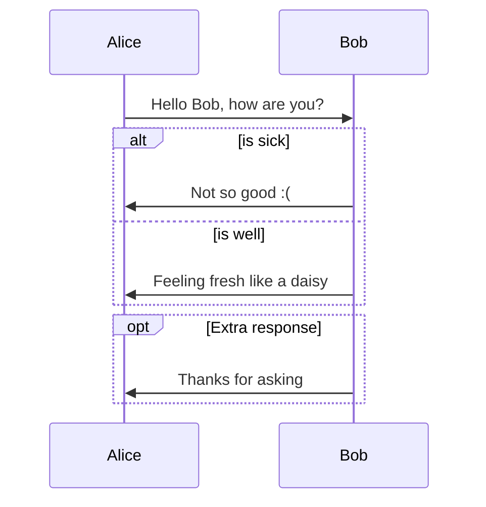
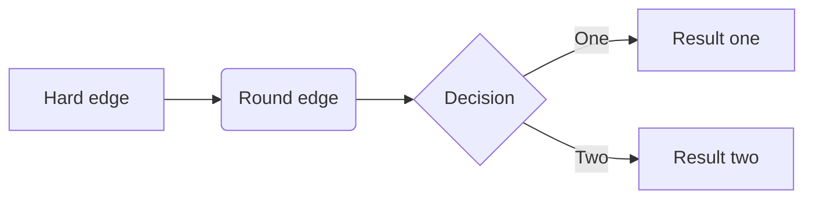
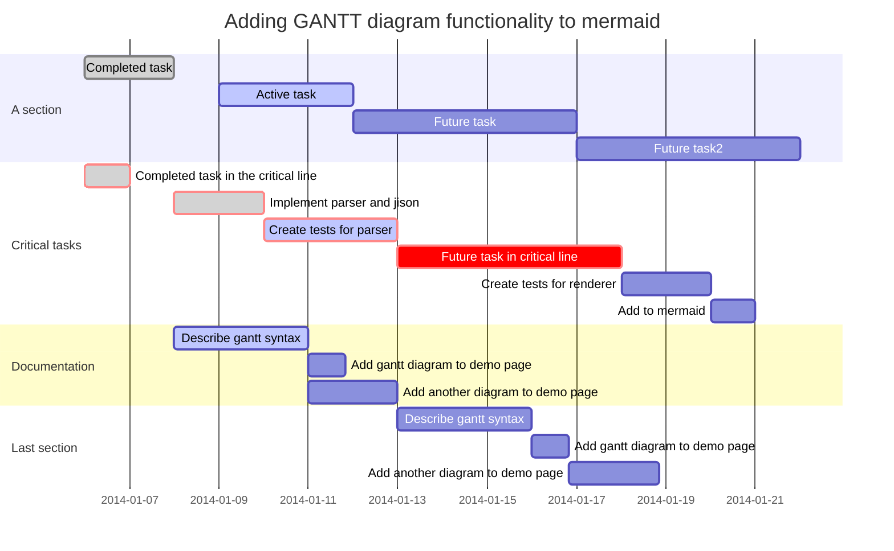
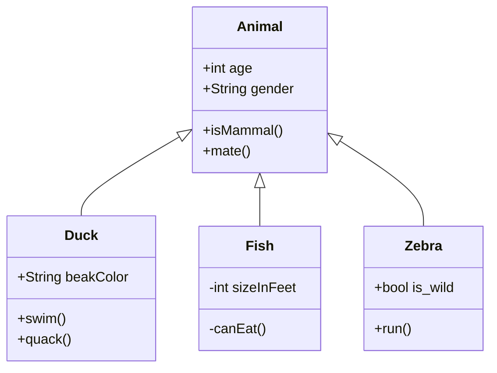
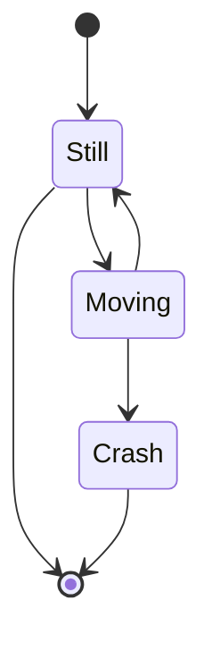
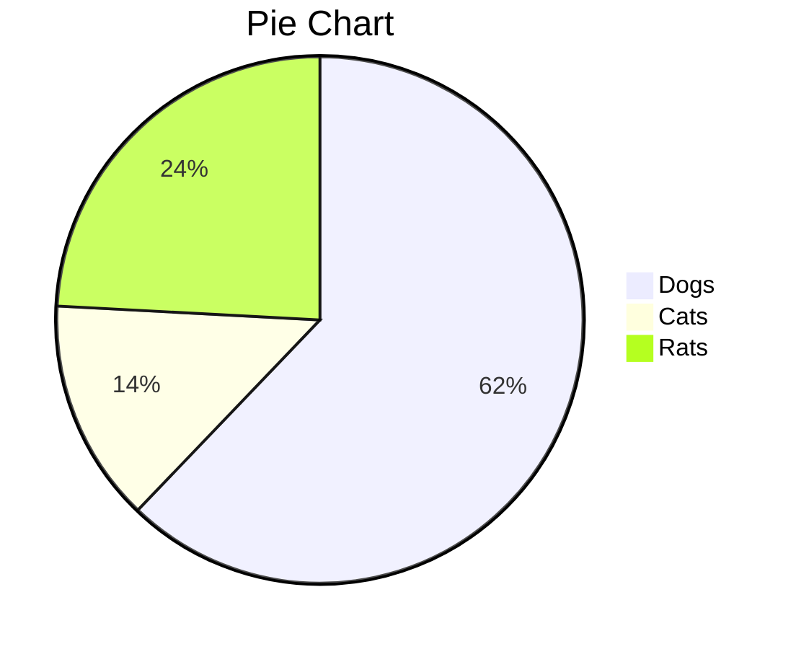

# <center>Typora学习笔记</center>


<center>文档历史记录</center>

----

| 版本 | 状态 |             作者             |    日期    | 说明                                                         |
| :--: | :--: | :--------------------------: | :--------: | ------------------------------------------------------------ |
| V0.1 | 草稿 | [Jiang Su](buaajs@gmail.com) | 2020-07-05 | 构建文档架构<br />参考[Typora官网文档](http://support.typora.io/Draw-Diagrams-With-Markdown/)完成草稿 |
|      |      |                              |            |                                                              |


---

## 5. 绘制图Draw Diagrams

### 5.0 参考资料

|  类别   | 网址                                                        | 说明                |
| :-----: | ----------------------------------------------------------- | ------------------- |
| Website | http://support.typora.io/Draw-Diagrams-With-Markdown/       | Typora官网文档      |
|  Blog   | https://blog.csdn.net/qq_43367829/article/details/104810351 | CSDN技术文章        |
| Website | https://bramp.github.io/js-sequence-diagrams/               |                     |
| Website | http://flowchart.js.org/                                    |                     |
| Website | https://mermaid-js.github.io/mermaid/                       | mermaid官网         |
| GitHub  | https://github.com/knsv/mermaid                             | mermaid的GitHub项目 |

---

### 5.1 简介

==Typora支持通过**Markdown扩展语法**来绘制相关图==（序列图[sequence](https://bramp.github.io/js-sequence-diagrams/), 流程图[flowchart](http://flowchart.js.org/) and [mermaid](https://knsv.github.io/mermaid/#mermaid)），其中==Mermaid支持渲染序列图、流程图、甘特图、类图、状态图和饼图==。

> 注：要使Typora支持**Markdown扩展语法**来绘制图，需要从【File|文件】-【Perferences...|偏好设置...】-【Markdown】-【Syntax Support | Markdown扩展语法】下启用`Diagrams (Sequence、Flowchart and Mermaid) | 图表 （序列图、流程图和Marmaid图）` 复选项（如下图示），并重启Typora。


当Typora将markdown导出为HTML、PDF、epub、docx文件格式时，相关渲染图也将包括在内；但是当Typora将markdown导出为当前版本的其他文件格式时，不支持图。

> 注意：==标准Markdown、CommonMark或GFM不支持图==。因此，仍然建议在编辑时插入这些图的图片，而不是直接将它们写在Markdown中。

---

### 5.2 序列图Sequence Diagrams

此功能使用[js-sequence](https://bramp.github.io/js-sequence-diagrams/)，它将以下代码块转换为渲染图。

~~~gfm
```sequence
李雷->张华: Hello 张华, how are you?
Note right of 张华: 张华 thinks
张华-->李雷: I am good thanks!
```
~~~

<span style='color:green'>渲染后的UML序列图显示效果如下：</span>

```sequence
李雷->张华: Hello 张华, how are you?
Note right of 张华: 张华 thinks
张华-->李雷: I am good thanks!
```

有关更多详细信息，请参见此[语法说明](https://bramp.github.io/js-sequence-diagrams/#syntax)。

---

### 5.3 流程图Flowcharts

此功能使用 [flowchart.js](http://flowchart.js.org/)，它将以下代码块转换为渲染图。

~~~gfm
```flow
st=>start: Start
op=>operation: Your Operation
cond=>condition: Yes or No?
e=>end

st->op->cond
cond(yes)->e
cond(no)->op
```
~~~

<span style='color:green'>渲染后的流程图显示效果如下：</span>

```flow
st=>start: Start
op=>operation: Your Operation
cond=>condition: Yes or No?
e=>end

st->op->cond
cond(yes)->e
cond(no)->op
```

----

### 5.4 Mermaid

[Mermaid](https://mermaid-js.github.io/mermaid/#/) 是一个用于绘制序列图、流程图、甘特图、类图、状态图和饼图的库，使用 JavaScript 进行本地渲染。Mermaid广泛集成于许多 Markdown 编辑器中，==Typora也集成了 Mermaid==。

Mermaid 作为一个使用 JavaScript 渲染的库，生成的不是一个“图片”，而是一段 HTML 代码，因此比较安全。

---

#### 5.4.1 序列图Sequence Diagrams

有关序列图更多详细信息，请参见：https://mermaid-js.github.io/mermaid/#/sequenceDiagram。

~~~markdown

~~~

<span style='color:green'>上述代码块会自动被mermaid解析和渲染，经渲染后的序列图显示效果如下：</span>


---

#### 5.4.2 流程图Flowcharts

有关流程图更多详细信息，请参见：https://mermaid-js.github.io/mermaid/#/flowchart

~~~markdown

~~~

<span style='color:green'>上述代码块会自动被mermaid解析和渲染，经渲染后的流程图显示效果如下：</span>


----

#### 5.4.3 甘特图Gantt Charts

有关甘特图更多详细信息，请参见： https://mermaid-js.github.io/mermaid/#gantt

~~~gfm

~~~

<span style='color:green'>上述代码块会自动被mermaid解析和渲染，经渲染后的甘特图显示效果如下：</span>


----

#### 5.4.4 类图Class Diagrams

有关类图更多详细信息，请参见：https://mermaid-js.github.io/mermaid/#/classDiagram

~~~gfm

~~~

<span style='color:green'>上述代码块会自动被mermaid解析和渲染，经渲染后的类图显示效果如下：</span>


---

#### 5.4.5 状态图State Diagrams

有关状态图更多详细信息，请参见：https://mermaidjs.github.io/#/stateDiagram

~~~gfm

~~~

<span style='color:green'>上述代码块会自动被mermaid解析和渲染，经渲染后的状态图显示效果如下：</span>


----

#### 5.4.6 饼图Pie Charts Diagrams

有关饼图更多详细信息，请参见：https://mermaid-js.github.io/mermaid/#/pie

```markdown
​```mermaid
pie
    title Pie Chart
    "Dogs" : 386
    "Cats" : 85
    "Rats" : 150 
​```
```

<span style='color:green'>上述代码块会自动被mermaid解析和渲染，经渲染后的饼图图显示效果如下：</span>



